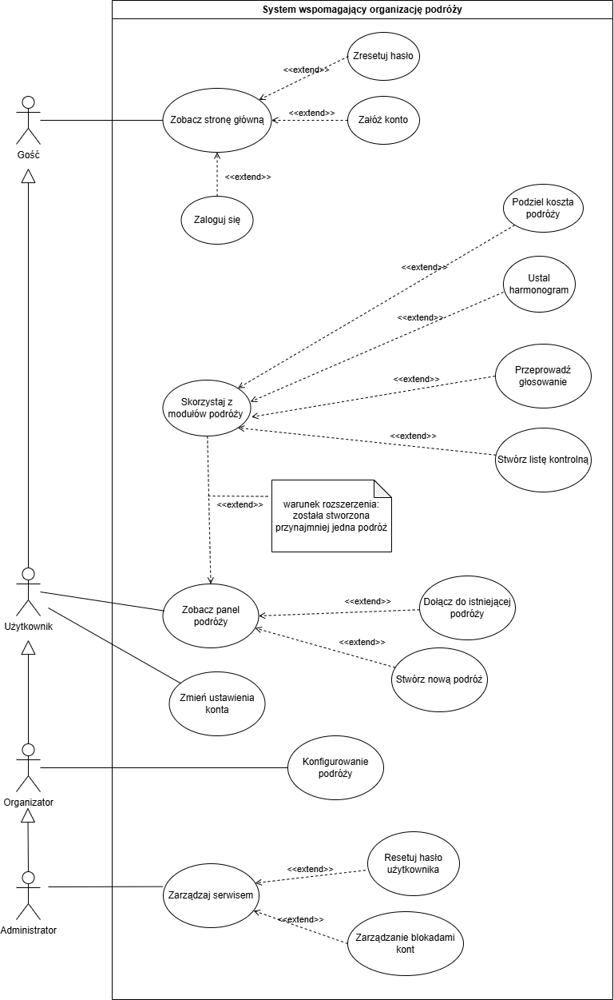
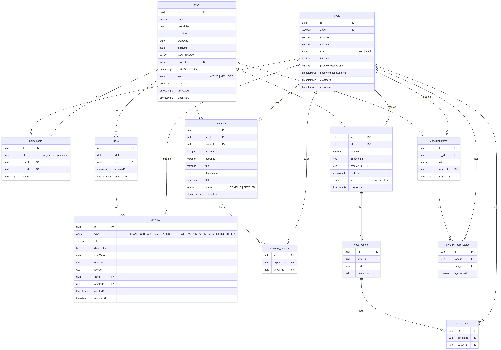
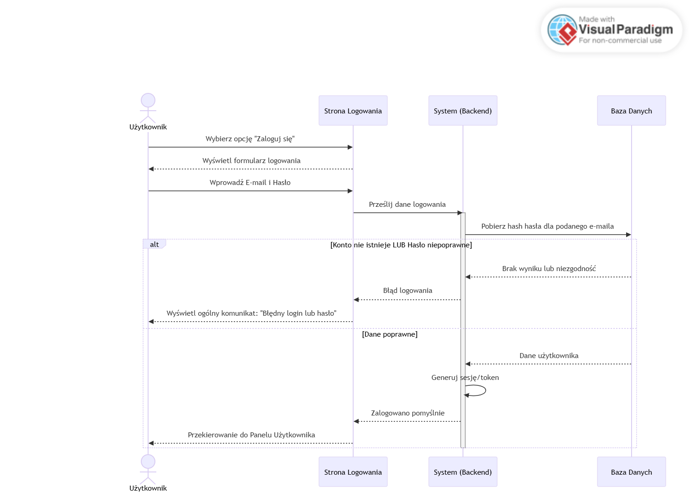
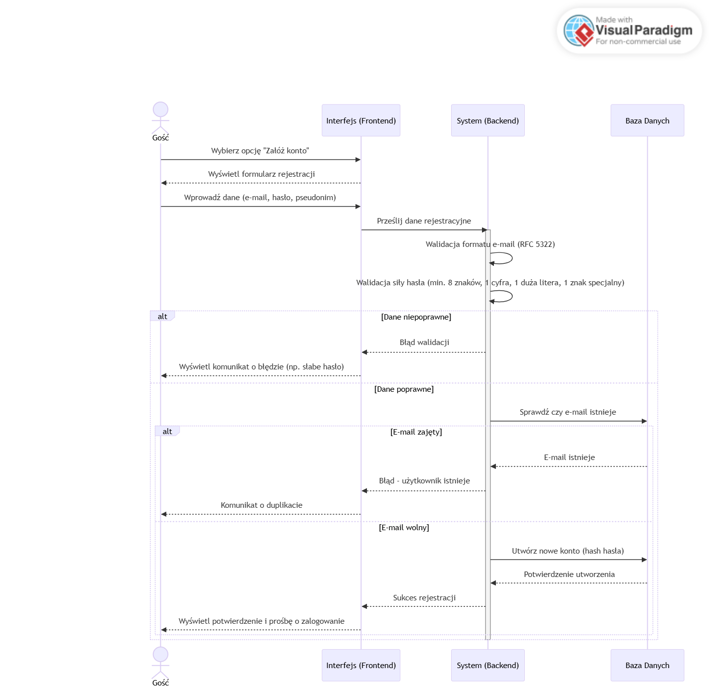
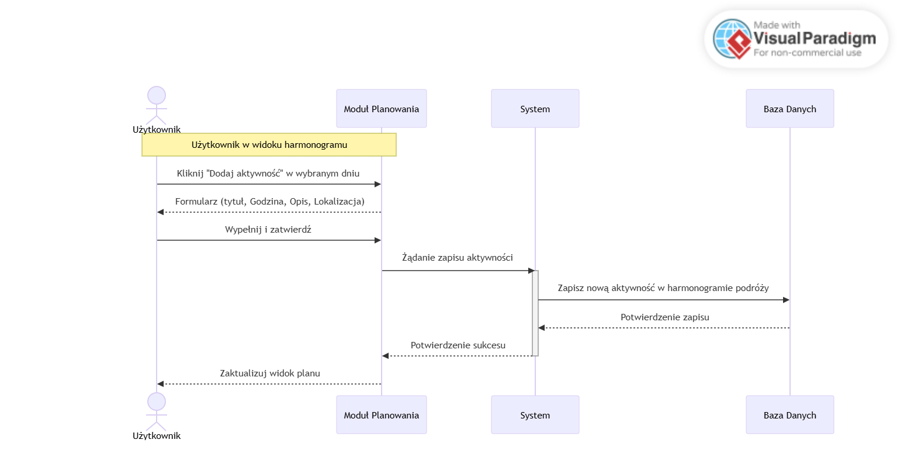
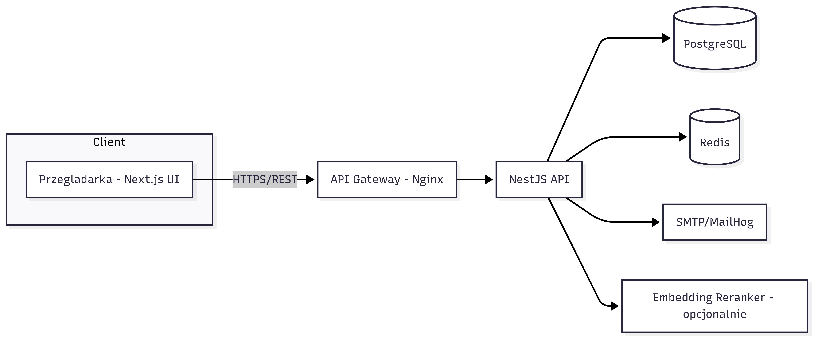
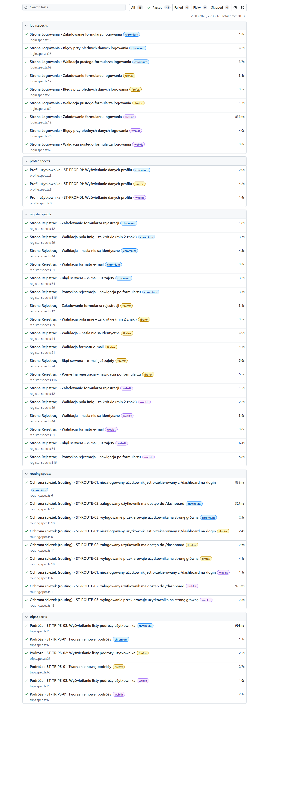
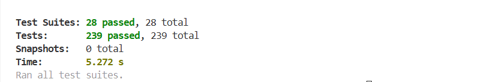
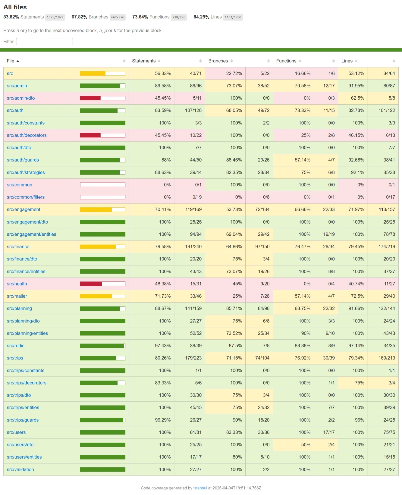

   <h1>Dokumentacja projektu</h1>
   <h2>ShareWay</h2>
   <h3>Aplikacja do organizacji wyjazdow grupowych</h3>
   
<strong>Zespol:</strong>

   
Aleksandra Zegler

   
Amelia Hajkowska

   
Mikita Kasevich

   
Stanislau Liatsko

   
Kanstantsin Humianka

## Spis tresci

- [Spis tresci](#spis-tresci)
- [1. Opis problemu](#1-opis-problemu)
  - [1.1. Opis projektu](#11-opis-projektu)
  - [1.2. Porównanie dostępnych rozwiązań](#12-porównanie-dostępnych-rozwiązań)
  - [1.3. Możliwości zastosowania praktycznego](#13-możliwości-zastosowania-praktycznego)
- [2. Projekt i analiza](#2-projekt-i-analiza)
  - [2.1. Aktorzy, Przypadki użycia, Wymagania funkcjonalne i niefunkcjonalne](#21-aktorzy-przypadki-użycia-wymagania-funkcjonalne-i-niefunkcjonalne)
    - [Aktorzy i charakterystyka użytkowników](#aktorzy-i-charakterystyka-użytkowników)
    - [Przypadki użycia](#przypadki-użycia)
    - [Wymagania funkcjonalne](#wymagania-funkcjonalne)
    - [Wymagania niefunkcjonalne](#wymagania-niefunkcjonalne)
  - [2.2. Diagram klas](#22-diagram-klas)
  - [2.3. Diagram modelu danych (ERD)](#23-diagram-modelu-danych-erd)
  - [2.4. Projekt interfejsu użytkownika](#24-projekt-interfejsu-użytkownika)
  - [2.5. Diagramy sekwencji (kluczowe procesy)](#25-diagramy-sekwencji-kluczowe-procesy)
- [3. Implementacja](#3-implementacja)
  - [3.1. Architektura rozwiązania](#31-architektura-rozwiązania)
    - [Wzorce projektowe](#wzorce-projektowe)
  - [3.2. Użyte technologie](#32-użyte-technologie)
- [4. Testy](#4-testy)
- [4.1. Strategia testowania i zakres testów](#41-strategia-testowania-i-zakres-testów)
- [4.2. Scenariusze testowe](#42-scenariusze-testowe)
  - [4.2.1. Uwierzytelnianie (Auth)](#421-uwierzytelnianie-auth)
  - [4.2.2. Rejestracja (Register)](#422-rejestracja-register)
  - [4.2.3. Zarządzanie podróżą (Trips)](#423-zarządzanie-podróżą-trips)
  - [4.2.4. Finanse i koszty (Finance)](#424-finanse-i-koszty-finance)
  - [4.2.5. Harmonogram (Planning)](#425-harmonogram-planning)
  - [4.2.6. Lista kontrolna (Checklist)](#426-lista-kontrolna-checklist)
  - [4.2.7. Głosowanie (Voting)](#427-głosowanie-voting)
  - [4.2.8. Profil użytkownika](#428-profil-użytkownika)
  - [4.2.9. Panel Administratora (Admin)](#429-panel-administratora-admin)
  - [4.2.10. Ochrona ścieżek (Routing)](#4210-ochrona-ścieżek-routing)
- [4.3. Raport z testów](#43-raport-z-testów)
  - [4.3.1. Testy automatyczne (E2E – Playwright)](#431-testy-automatyczne-e2e--playwright)
  - [4.3.2. Testy manualne (Funkcjonalne)](#432-testy-manualne-funkcjonalne)
  - [4.3.3 Testy jednostkowe](#433-testy-jednostkowe)
  - [4.4. Wnioski](#44-wnioski)

---

## 1. Opis problemu

### 1.1. Opis projektu

ShareWay to aplikacja webowa stworzona w celu wsparcia organizacji wyjazdów grupowych. Planowanie wspólnych podróży składa się z wielu aspektów: ustalania harmonogramu, podziału kosztów, zarządzania listą rzeczy do zabrania oraz podejmowania wspólnych decyzji przez grupę. Brak jednego narzędzia, które gromadziłoby te wszystkie dane, prowadzi do rozproszenia informacji pomiędzy różnymi komunikatorami i notatkami, co skutkuje dezorganizacją.

Celem projektu jest stworzenie w pełni funkcjonalnego **prototypu** aplikacji webowej, która integruje wszystkie kluczowe narzędzia potrzebne podczas planowania grupowego wyjazdu w jednym miejscu. Aplikacja umożliwia tworzenie grup podróżnych, zarządzanie harmonogramem, rozliczanie wydatków, przeprowadzanie głosowań oraz prowadzenie wspólnej listy kontrolnej.

Projekt stanowi prototyp gotowy do dalszego rozwoju. Zaimplementowane zostały funkcjonalności z myślą o realnym użytkowaniu.

### 1.2. Porównanie dostępnych rozwiązań

Na rynku istnieje kilka aplikacji częściowo pokrywających potrzeby grup podróżnych:

| Funkcjonalność | ShareWay | Splitwise | TripIt | Google Docs |
|---|---|---|---|---|
| Podział kosztów | TAK | TAK | NIE | Ręcznie |
| Harmonogram podróży | TAK | NIE | TAK | Ręcznie |
| Głosowania grupowe | TAK | NIE | NIE | NIE |
| Lista kontrolna | TAK | NIE | NIE | Ręcznie |
| System zaproszeń | TAK (kod) | TAK | NIE | NIE |
| Panel administratora | TAK | NIE | NIE | NIE |
| Polska wersja językowa | TAK | Częściowo | NIE | TAK |

ShareWay wyróżnia się integracją wszystkich niezbędnych narzędzi w jednej aplikacji.

### 1.3. Możliwości zastosowania praktycznego

Aplikacja ShareWay może być wykorzystana w następujących sytuacjach:

- **Wyjazdy wakacyjne** grup znajomych lub rodzin - planowanie trasy, podział kosztów noclegów i atrakcji, wspólna lista rzeczy do spakowania.
- **Firmowe wyjazdy integracyjne** - koordynacja harmonogramu, głosowania nad atrakcjami, przejrzyste rozliczenia.
- **Wycieczki studenckie i szkolne** - organizator zarządza grupą, uczestnicy śledzą plan i listę wymagań.
- **Eventy i imprezy okolicznościowe** (np. wieczory kawalerskie) - szybkie ustalanie szczegółów przez głosowania, podział kosztów.
- **Długoterminowe projekty podróżnicze** - wieloetapowe wyprawy wymagające szczegółowego planowania harmonogramu.

---

## 2. Projekt i analiza

### 2.1. Aktorzy, Przypadki użycia, Wymagania funkcjonalne i niefunkcjonalne

#### Aktorzy i charakterystyka użytkowników

**Diagram aktorów:**

**Gość**

| Pole             | Wartość                                                                                                          |
| ---------------- | ---------------------------------------------------------------------------------------------------------------- |
| **ID**           | GUEST                                                                                                            |
| **Nazwa**        | Gość                                                                                                             |
| **Opis**         | Osoba nieposiadająca konta lub niezalogowana. Może przeglądać stronę główną i rozpocząć rejestrację / logowanie. |
| **Uprawnienia**  | • Podgląd strony głównej (landing page) • Dostęp do formularzy rejestracji i logowania • Wysłanie żądania resetowania hasła                                            |
| **Główne akcje** | • Przeglądaj stronę główną • Zarejestruj się (POST /api/v1/auth/register) • Zaloguj się (POST /api/v1/auth/login) • Wyślij żądanie resetu hasła                                   |
| **Ograniczenia** | Brak dostępu do jakichkolwiek modułów aplikacji (podróże, harmonogram, finanse, głosowania). |

**Użytkownik**

| Pole             | Wartość                                                                                                                                                                                          |
| ---------------- | ------------------------------------------------------------------------------------------------------------------------------------------------------------------------------------------------ |
| **ID**           | USER                                                                                                                                                                                             |
| **Nazwa**        | Użytkownik                                                                                                                                                                                       |
| **Opis**         | Osoba z aktywnym kontem po zalogowaniu. Ma pełny dostęp do wszystkich modułów aplikacji w ramach podróży, do których należy.                                                                                           |
| **Uprawnienia**  | • Wszystkie uprawnienia Gościa • Tworzenie nowych podróży • Dołączanie do podróży przez kod • Dostęp do panelów wszystkich podróży, w których uczestnicy • Edycja własnego profilu • Zmiana hasła i e-maila                                                                                                                       |
| **Główne akcje** | • Utwórz podróż (POST /api/v1/trips) • Dołącz do podróży przez kod zaproszenia (POST /api/v1/trips/join) • Dodawanie/edycja dni i aktywości w harmonogramie • Dodawanie wydatków i podgląd rozliczeń • Tworzenie i udział w głosowaniach • Zarządzanie listą kontrolną • Edycja profilu (PATCH /api/v1/users/me) |
| **Ograniczenia** | • Nie może edytować metadanych podróży (chyba że jest organizatorem) • Nie może usuwać innych użytkowników z grupy • Brak dostępu do panelu administracyjnego |

**Organizator**

| Pole             | Wartość                                                                                                                            |
| ---------------- | ---------------------------------------------------------------------------------------------------------------------------------- |
| **ID**           | ORGANIZER                                                                                                                          |
| **Nazwa**        | Organizator                                                                                                                        |
| **Opis**         | Właściciel/administrator konkretnej podróży. Zarządza danymi podróży, kodami zaproszeń i polityką edycji modułów.                  |
| **Uprawnienia**  | Wszystko, co Użytkownik + edycja metadanych podróży; generowanie/odwołanie kodów; moderacja treści w planie.                       |
| **Główne akcje** | • Konfiguruj podróż (nazwa, termin, lokalizacja) • Generuj kod zaproszenia • Ustalaj zasady edycji planu i rozliczeń |

**Administrator systemu**

| Pole             | Wartość                                                                                                    |
| ---------------- | ---------------------------------------------------------------------------------------------------------- |
| **ID**           | ADMIN                                                                                                      |
| **Nazwa**        | Administrator systemu                                                                                      |
| **Opis**         | Rola systemowa z najwyższymi uprawnieniami. Odpowiada za nadzór nad systemem, zarządzanie użytkownikami i grupy, bezpieczeństwo oraz interwencje w przypadku nagłych sytuacji.                                      |
| **Uprawnienia**  | • Wgląd w listę wszystkich użytkowników (GET /api/v1/admin/users) • Wgląd w listę wszystkich podróży (GET /api/v1/admin/trips) • Szczegóły dowolnego użytkownika (GET /api/v1/admin/users/:id) • Blokowanie kont użytkowników (PATCH /api/v1/admin/users/:id/ban) • Odblokowywanie kont (PATCH /api/v1/admin/users/:id/unban)                               |
| **Główne akcje** | • Zarządzaj użytkownikami (ban, unban, promote) • Monitoruj podróże • Rozwiązuj spory/incydenty • Wymuszaj polityki bezpieczeństwa |
| **Dostęp**        | Panel administracyjny dostępny pod `/admin` (wymaga roli ADMIN). Chroniony przez `RolesGuard`. |
| **Uwagi**        | Rola przypisywana ręcznie w bazie danych lub przez innego admina. Nie dziedziczy uprawnień Organizatora do konkretnych podróży. |

**Usługi systemowe**

| Pole             | Wartość                                                                                                                                                             |
| ---------------- | ------------------------------------------------------------------------------------------------------------------------------------------------------------------- |
| **ID**           | SYSTEM                                                                                                                                                              |
| **Nazwa**        | Usługi systemowe                                                                                                                                                    |
| **Opis**         | Zautomatyzowane procesy backendu działające w tle bez bezpośredniego udziału użytkownika. Zapewniają poprawną walidację danych, generowanie tokenów, obliczenia biznesowe i wysyłkę powiadomień.                                                                 |
| **Uprawnienia**  | Operacje serwisowe w ramach logiki biznesowej, bez interakcji z użytkownikiem.                                                                                             |
| **Główne akcje** | • **Walidacja danych**: format e-mail (RFC 5322), siła hasła (regex), poprawność dat, kwot • **Generowanie kodów**: kody zaproszeń (6 znaków alfanumerycznych), tokeny resetu hasła (UUID) • **Obliczenia finansowe**: algorytm minimalizacji długów w rozliczeniach grupowych • **Zarządzanie sesjami**: weryfikacja i odświeżanie JWT tokenów, wygaśnięcie w Redis • **Wysyłka e-maili**: mail powitalny, reset hasła, powiadomienia o zmianach • **Health checks**: monitorowanie stanu bazy, Redis, serwisów |
| **Implementacja** | • Pipes: `ValidationPipe` (class-validator) • Guards: `JwtAuthGuard`, `RolesGuard`, `TripAccessGuard` • Serwisy: `MailerService`, `RedisRepository`, `FinanceService.calculateBalance()` • Event Emitters: `EventEmitter2` dla asynchronicznych zdarzeń |

#### Przypadki użycia

| ID:                     | **Homepage**      |
| ------                  | ------------------|
| Nazwa:                  | **Strona główna** |
| **Aktorzy główni:**     | Wszyscy |
| **Aktorzy pomocniczy:** | brak    |
| **Poziom:**             | Użytkownika |
| **Priorytet:**          | P0 |
| **Opis:**               | Ekran powitalny aplikacji zawierający opis systemu, jego funkcje oraz opcje do wyboru. |
| **Wyzwalacze:**         | **1.** Admin uruchamia interfejs systemu. |
| **Warunki początkowe:** | **1.** Brak |
| **Warunki końcowe:**    | **1.** Gość widzi zawartość strony głównej |
| **Scenariusz główny:**  | **1.** Gość uruchamia interfejs systemu.   **2.** System wyświetla stronę główną zawierającą:   a. Opcję "Zarejestruj się"   b. Opcję "Zaloguj się "  c. Opis funkcjonalności aplikacji. |
| **Scenariusze alternatywne:** | Brak |
| **Wyjątki:**                  | Brak |
| **Dodatkowe wymagania:**      | Brak |

| ID:                     | Register                 |
| ------                  | ------------------------ |
| Nazwa:                  | **Rejestracja nowego konta** |
| **Aktorzy główni:**     | Gość |
| **Poziom:**             | Użytkownika |
| **Priorytet:**          | P0 |
| **Opis:**               | Gość zakłada nowe konto, aby uzyskać dostęp do funkcji aplikacji i móc tworzyć lub dołączać do grup podróżnych. |
| **Wyzwalacze:**         | **1.** Gość wybiera opcję „Zarejestruj się”. |
| **Warunki początkowe:** | Brak |
| **Warunki końcowe:**    | Konto użytkownika zostało zarejestrowane w systemie. |
| **Scenariusz główny:**  | **1.** Gość wybiera opcję „Zarejestruj się”.   **2.** System wyświetla formularz rejestracji konta.   **3.** Gość wypełnia formularz następującymi danymi:   a. e-mail,   b. hasło,   c. potwierdzenie hasła,   d. pseudonim   **4.** Gość zatwierdza formularz.   **5.** System tworzy konto.   **6.** System wyświetla potwierdzenie rejestracji konta Gościowi. |
| **Scenariusze alternatywne:** | Brak |
| **Wyjątki:**                  | **1.** Adres e-mail istnieje już w systemie.   a. System wyświetla informację o duplikacie.   b. System wyświetla ponownie formularz rejestracji.   **2.** Hasło oraz powtórzone hasło nie są identyczne.   a. System wyświetla informację o niepasujących hasłach   b. System ponownie wyświetla formularz rejestracji.   **3.** Hasło nie spełnia wymagań bezpieczeństwa.   a. System wyświetla informację o zbyt słabym haśle.   b. System ponownie wyświetla formularz rejestracji.|
| **Dodatkowe wymagania:**     | **1.** Format​ ​adresu​ ​e-mail​ ​musi​ ​być​ ​sprawdzany​ ​pod​ ​względem​ ​zgodności​ ​z​ ​RFC​ ​5322.   **2.** Hasło​ ​oraz​ ​powtórzone​ ​hasło​ ​musi​ ​być​ ​sprawdzane​ ​czy​ ​są​ ​identyczne.   **3.** Hasło musi być sprawdzane czy zawiera przynajmniej 8 znaków, 1 cyfrę, 1 wielką i 1 małą literę​ ​oraz​ ​znak​ ​specjalny. |

| ID:    | Login                    |
| ------ | ------------------------ |
| Nazwa: | **Logowanie do systemu**     |
| **Aktorzy główni:** | Użytkownik |
| **Poziom:** | Użytkownika |
| **Priorytet:** | P0 |
| **Opis:** | Użytkownik loguje się, aby uzyskać dostęp do swoich grup podróżnych i funkcji aplikacji. |
| **Wyzwalacze:** | **1.** Użytkownik wybiera „Zaloguj się”. |
| **Warunki początkowe:** | Konto użytkownika istnieje. |
| **Warunki końcowe:** | Użytkownik jest zalogowany i ma dostęp do funkcji aplikacji. |
| **Scenariusz główny:** | **1.** Użytkownik wybiera „Zaloguj się”.   **2.** Wprowadza e-mail i hasło.   **3.** System weryfikuje dane.   **4.** Po poprawnym logowaniu użytkownik zostaje przekierowany do swojego panelu. |
| **Scenariusze alternatywne:** | Brak. |
| **Wyjątki:** | **1.** Nieprawidłowy e-mail lub hasło.   a. System wyświetla komunikat o błędzie.   b. System wyświetla ponownie formularz logowania. |
| **Dodatkowe wymagania:** | Ze względów bezpieczeństwa, system nie może informować Gościa, które pole formularza zawiera błąd. Komunikat powinien być ogólny np. "Błędny login lub/i hasło".|

| ID:    | ForgotPassword           |
| ------ | ------------------------ |
| Nazwa: | **Reset hasła**     |
| **Aktorzy główni:** | Gość / Użytkownik |
| **Poziom:** | Użytkownika |
| **Priorytet:** | P1 |
| **Opis:** | Użytkownik, który zapomniał hasła, może je zresetować przy użyciu linku wysłanego na e-mail. |
| **Wyzwalacze:** | **1.** Użytkownik wybiera „Nie pamiętam hasła". |
| **Warunki początkowe:** | Konto użytkownika istnieje w systemie. |
| **Warunki końcowe:** | Użytkownik ustawił nowe hasło. |
| **Scenariusz główny:** | **1.** Użytkownik wybiera „Nie pamiętam hasła".   **2.** Wprowadza adres e-mail.   **3.** System generuje unikalny token resetowania i wysyła link na e-mail.   **4.** Użytkownik klika w link i zostaje przekierowany na stronę resetowania hasła.   **5.** Wprowadza nowe hasło i potwierdza je.   **6.** System weryfikuje token i aktualizuje hasło. |
| **Wyjątki:** | **1.** E-mail nie istnieje w systemie.   a. System wyświetla ogólny komunikat (ze względów bezpieczeństwa nie ujawnia, czy e-mail istnieje).   **2.** Token wygasł lub jest nieprawidłowy.   a. System wyświetla komunikat o nieważnym linku i prosi o ponowne wysłanie.   **3.** Nowe hasło nie spełnia wymagań bezpieczeństwa.   a. System wyświetla informację o zbyt słabym haśle. |
| **Dodatkowe wymagania:** | **1.** Token resetowania hasła powinien być ważny przez 1 godzinę.   **2.** Token może być użyty tylko raz.   **3.** Hasło musi spełniać wymagań: min. 8 znaków, 1 wielka litera, 1 mała litera, 1 cyfra, 1 znak specjalny. |

| ID:    | CreateTrip               |
| ------ | ------------------------ |
| Nazwa: | **Utwórz nową podróż**       |
| **Aktorzy główni:** | Użytkownik |
| **Poziom:** | Użytkownika |
| **Priorytet:** | P0 |
| **Opis:** | Użytkownik tworzy nową podróż i ustala jej podstawowe parametry, takie jak nazwa, termin, lokalizacja. |
| **Wyzwalacze:** | **1.** Użytkownik klika przycisk "Create".|
| **Warunki początkowe:** | Użytkownik jest zalogowany. |
| **Warunki końcowe:** | Nowa grupa podróżna została utworzona. |
| **Scenariusz główny:** | **1.** Użytkownik wybiera „Utwórz podróż”.   **2.** Wypełnia formularz: nazwa, termin, lokalizacja.   **3.** Użytkownik klika "Zapisz", aby zapisać formularz.   **4.** System zapisuje podróż i generuje unikalny kod zaproszenia. |
| **Scenariusze alternatywne:** | Brak. |
| **Wyjątki:** | **1.** Brak wymaganych danych.   a. System prosi o uzupełnienie pól. |
| **Dodatkowe wymagania:** | System powinien umożliwiać organizatorowi późniejszą edycję danych podróży. |

| ID:    | JoinTrip                      |
| ------ | ----------------------------- |
| Nazwa: | **Dołącz do istniejącej podróży** |
| **Aktorzy główni:** | Użytkownik |
| **Poziom:** | Użytkownika |
| **Priorytet:** | P0 |
| **Opis:** | Użytkownik dołącza do istniejącej grupy podróżnej poprzez wprowadzenie kodu zaproszenia. |
| **Wyzwalacze:** | **1.** Użytkownik klika przycisk "Join".|
| **Warunki początkowe:** | Użytkownik jest zalogowany. |
| **Warunki końcowe:** | Użytkownik pomyślnie dołączył do grupy podróżnej. |
| **Scenariusz główny:** | **1.** Użytkownik wybiera „Dołącz do podróży”.   **2.** Wpisuje kod zaproszenia.   **3.** System weryfikuje kod.   **4.** Jeśli poprawny, użytkownik zostaje dodany do grupy. |
| **Wyjątki:** | **1.** Kod niepoprawny.   a. System wyświetla komunikat o błędzie. |
| **Dodatkowe wymagania:** | Kod zaproszenia powinien być unikalny. |

| ID:    | ViewTrip               |
| ------ | ------------------------ |
| Nazwa: | **Panel podróży**     |
| **Aktorzy główni:** | Użytkownik |
| **Poziom:** | Użytkownika |
| **Priorytet:** | P0 |
| **Opis:** | Podgląd podróży. |
| **Wyzwalacze:** | Użytkownik został zalogowany do systemu i znajduje się w panelu podróży. |
| **Warunki początkowe:** | Użytkownik jest zalogowany. |
| **Warunki końcowe:** | Użytkownik widzi aktualną listę grup podróżnych, których jest uczestnikiem. |
| **Scenariusz główny:** | **1.** Użytkownik loguje się do systemu.   **2.** Użytkownik widzi listę grup podróżnych. |
| **Scenariusz alternatywny** | **1.** Użytkownik nie należy do żadnej grupy.   a. System wyświetla informację "Nie należysz do żadnej grupy podróżnej". |
| **Scenariusz alternatywny** | **1.** Użytkownik znajduje się w module podróży.   a. Użytkownik klika "Powróć".   b. Użytkownik znajduje się w panelu podglądu podróży. |
| **Scenariusz alternatywny** | **1.** Użytkownik, który stworzył podróż klika ikonę edycji.   **2.** Edytuje dane wybranej podróży.   **3.** Zapisuje zmiany.   **4.** Dane podróży zostały zmienione. |
| **Wyjątki:**           | Brak |
| **Dodatkowe wymagania:** | **1.** Użytkownik może kliknąć na daną grupę podróżną, aby zyskać dostęp do modułów dotyczących danej podróży.   **2.** Użytkownik, który stworzył podróż ma uprawnienia do jej edycji. |

| ID:    | AdminPanel               |
| ------ | ------------------------ |
| Nazwa: | **Panel admina**     |
| **Aktorzy główni:** | Admin |
| **Poziom:** | Użytkownika |
| **Priorytet:** | P1 |
| **Opis:** | Admin zarządza danymi użytkowników oraz grup podróżnych. |
| **Wyzwalacze:** | **1.** Użytkownik z rolą admina loguje się do systemu i wybiera opcję przejścia do panelu administracyjnego. |
| **Warunki początkowe:** | **1.** Użytkownik posiada uprawnienia administracyjne (rola admin). **2.** Użytkownik jest zalogowany w systemie. |
| **Warunki końcowe:** | Zmiany dokonane przez administratora zostały zapisane i są widoczne dla pozostałych użytkowników. |
| **Scenariusz główny:** | **1.** Administrator wybiera sekcję (lista użytkowników, lista grup). **2.** Dokonuje wymaganych zmian administracyjnych, np. edytuje dane użytkownika lub grupy. **3.** Zapisuje zmiany. **4.** System potwierdza zapis zmian. |
| **Wyjątki:** |  **1.** Brak uprawnień administratora   a. System nie umożliwia dostępu do listy użytkowników i wyświetla komunikat o braku uprawnień. **2.** Błąd zapisu zmian  a. System wyświetla komunikat o niepowodzeniu operacji (razem z ewentualnym wytłumaczeniem, np. hasło nie spełnia wymogów bezpieczeństwa).|
| **Dodatkowe wymagania:** | **1.** Dostęp wyłącznie dla użytkowników z rolą admina.  **2.** Panel powinien umożliwiać szybkie wyszukiwanie i filtrowanie użytkowników oraz grup.|

| ID:    | Settings                 |
| ------ | ------------------------ |
| Nazwa: | **Zarządzanie ustawieniami** |
| **Aktorzy główni:** | Użytkownik |
| **Poziom:** | Użytkownika |
| **Priorytet:** | P1 |
| **Opis:** | Użytkownik edytuje dane dotyczące jego konta. |
| **Wyzwalacze:** | Użytkownik klika "Ustawienia". |
| **Warunki początkowe:** | Użytkownik jest zalogowany. |
| **Warunki końcowe:** | Użytkownik zmienił ustawienia. |
| **Scenariusz główny:** | **1.** Użytkownik otwiera ustawienia konta.   **2.** Edytuje dane i zapisuje zmiany.   3. System aktualizuje profil i zapisuje konfigurację. |
| **Wyjątki:**             | **1.** Użytkownik chce zmienić e-mail na już istniejący w systemie.   a. System wyświetla informację o duplikacie.   **2.** Użytkownik podczas zmiany hasła, niepoprawnie wpisał powtórzenie hasła.   a. System wyświetla informację o niepasujących hasłach.   **3.** Użytkownik chce zmienić hasło na niespełniające wymagań bezpieczeństwa.   a. System wyświetla informację  o zbyt słabym haśle.  
| **Dodatkowe wymagania:** | Zmiana adresu e-mail lub hasła wymaga potwierdzenia aktualnych danych. |

| ID:    | VotingModule             |
| ------ | ------------------------ |
| Nazwa: | **Głosowanie**              |
| **Aktorzy główni:** | Użytkownik |
| **Poziom:** | Użytkownika |
| **Priorytet:** | P1 |
| **Opis:** | Moduł umożliwia użytkownikom grupy przeprowadzanie głosowań. |
| **Wyzwalacze:** | Użytkownik przechodzi do modułu "Głosowanie". |
| **Warunki początkowe:** | Użytkownik jest zalogowany i jest członkiem co najmniej jednej grupy. |
| **Warunki końcowe:** | Użytkownik korzysta z modułu głosowania. |
| **Scenariusz główny:** | **1.** Użytkownik tworzy głosowanie, dodając propozycje.   **2.** Członkowie grupy oddają głosy.   **3.** System aktualizuje wyniki. |
| **Wyjątki:**                  | Brak |
| **Dodatkowe wymagania:** | **1.** Możliwość dodawania nowych opcji głosowania w trakcie trwania ankiety.   **2.** W danym głosowaniu, można oddać głos tylko raz.   **3.** W danym głosowaniu można zmienić swój głos.|

| ID:    | PlanningModule           |
| ------ | ------------------------ |
| Nazwa: | **Planowanie wyjazdu**       |
| **Aktorzy główni:** | Użytkownik |
| **Poziom:** | Użytkownika |
| **Priorytet:** | P1 |
| **Opis:** | Moduł umożliwia planowanie harmonogramu podróży – dodawanie dni, aktywności, godzin i lokalizacji. |
| **Wyzwalacze:** | Użytkownik przechodzi do modułu "Planowanie" |
| **Warunki początkowe:** | Użytkownik jest zalogowany i jest członkiem co najmniej jednej grupy. |
| **Warunki końcowe:** | Użytkownik korzysta z modułu planowania. |
| **Scenariusz główny:** | **1.** Użytkownik otwiera moduł planowania.   **2.** Dodaje kolejne dni i aktywności.   **3.** System zapisuje plan i udostępnia go wszystkim uczestnikom grupy. |
| **Wyjątki:**                  | Brak |
| **Dodatkowe wymagania:** | System powinien umożliwiać edycję planu wszystkim użytkownikom. |

| ID:    | CostSharingModule        |
| ------ | ------------------------ |
| Nazwa: | **Podział kosztów**          |
| **Aktorzy główni:** | Użytkownik |
| **Poziom:** | Użytkownika |
| **Priorytet:** | P1 |
| **Opis:** | Moduł umożliwia użytkownikom wprowadzanie wydatków oraz automatyczne podsumowuje koszty i rozliczenia. |
| **Wyzwalacze:** | Użytkownik przechodzi do modułu "Podział kosztów" |
| **Warunki początkowe:** | Użytkownik jest zalogowany i jest członkiem co najmniej jednej grupy. |
| **Warunki końcowe:** | Użytkownik korzysta z modułu podziału kosztów. |
| **Scenariusz główny:** | **1.** Użytkownik dodaje nowy wydatek (kwota, opis, kto zapłacił).   **2.** System aktualizuje bilans dla każdego uczestnika.   **3.** Użytkownicy widzą podsumowanie kosztów i rozliczeń. |
| **Wyjątki:**                  | Brak |
| **Dodatkowe wymagania:** | Każdy użytkownik powinien widzieć swoje osobne rozliczenia. (co i ile jest komu winien.) |

| ID:    | ChecklistModule          |
| ------ | ------------------------ |
| Nazwa: | **Lista kontrolna**          |
| **Aktorzy główni:** | Użytkownik |
| **Poziom:** | Użytkownika |
| **Priorytet:** | P1 |
| **Opis:** | Moduł pozwala uczestnikom tworzyć wspólną listę rzeczy do zabrania lub zadań do wykonania przed podróżą. |
| **Wyzwalacze:** | Użytkownik przechodzi do modułu "Lista kontrolna" |
| **Warunki początkowe:** | Użytkownik jest zalogowany i jest członkiem co najmniej jednej grupy. |
| **Warunki końcowe:** | Użytkownik korzysta z modułu listy kontrolnej. |
| **Scenariusz główny:** | **1.** Użytkownik otwiera listę kontrolną.   **2.** Dodaje nowe pozycje (np. „ładowarka”, „namiot”).   **3.** Członkowie grupy mogą odznaczać wykonane pozycje. |
| **Wyjątki:**                  | Brak |
| **Dodatkowe wymagania:** | **1.** Każdy użytkownik może dodawać nowe pozycje do listy.   **2.** Odznaczenie wykonanych pozycji jest widoczne tylko dla danego użytkownika, nie dla wszystkich. |

#### Wymagania funkcjonalne

Poniższe wymagania wynikają bezpośrednio z przypadków użycia. Dla czytelności dodano mapowanie na przypadki użycia.

| ID | Wymaganie | Priorytet | Moduł | Źródło (przypadek użycia) |
|---|---|---|---|---|
| WF-01 | System umożliwia rejestrację konta (e-mail, hasło, pseudonim) z walidacją formatu i siły hasła. | P0 | Auth | Register |
| WF-02 | System umożliwia logowanie i zarządzanie sesją przy użyciu JWT (access + refresh token). | P0 | Auth | Login |
| WF-03 | System obsługuje reset hasła przez link wysłany na e-mail (token ważny 1h, jednorazowy). | P1 | Auth | ForgotPassword |
| WF-04 | Użytkownik może tworzyć nowe podróże (nazwa, termin, destynacja). | P0 | Trips | CreateTrip |
| WF-05 | System generuje unikalny 6-znakowy kod zaproszenia do każdej podróży. | P0 | Trips | CreateTrip |
| WF-06 | Użytkownik może dołączyć do podróży przez kod zaproszenia. | P0 | Trips | JoinTrip |
| WF-07 | Organizator może edytować dane podróży i zarządzać kodami zaproszeń. | P0 | Trips | ViewTrip |
| WF-08 | Użytkownik może dodawać dni i aktywności do harmonogramu podróży. | P1 | Planning | PlanningModule |
| WF-09 | System umożliwia dodawanie wydatków z automatycznym przeliczaniem bilansów. | P1 | Finance | CostSharingModule |
| WF-10 | Każdy uczestnik widzi swoje indywidualne rozliczenia (kto mu jest winien i ile). | P1 | Finance | CostSharingModule |
| WF-11 | Użytkownik może tworzyć głosowania z wieloma opcjami i oddawać głosy. | P1 | Voting | VotingModule |
| WF-12 | System umożliwia prowadzenie wspólnej listy kontrolnej z per-user statusem odznaczenia. | P1 | Checklist | ChecklistModule |
| WF-13 | Administrator może przeglądać, blokować i odblokowywać konta użytkowników. | P1 | Admin | AdminPanel |
| WF-14 | System wysyła powiadomienia e-mail (rejestracja, reset hasła, zmiana hasła). | P2 | Mailer | Register, ForgotPassword |

#### Wymagania niefunkcjonalne

| ID | Nazwa | Priorytet | Opis |
|---|---|---|---|
| WNF-01 | Bezpieczeństwo haseł | P0 | Hasła hashowane bcrypt (10 rund). Brak przechowywania haseł jawnych. |
| WNF-02 | Ochrona danych i prywatność | P0 | Dane grupy niedostępne dla osób spoza grupy. Każde żądanie do zasobów podróży weryfikowane przez TripAccessGuard. |
| WNF-03 | Autoryzacja i uwierzytelnianie | P0 | Access token (15 min) + refresh token (7 dni) w httpOnly cookies. Refresh tokeny w Redis. |
| WNF-04 | Walidacja danych | P0 | Backend: class-validator + DTO. Hasło: min. 8 znaków, 1 wielka, 1 mała, 1 cyfra, 1 znak specjalny. |
| WNF-05 | Rate limiting | P0 | Max 100 żądań/min/użytkownik (Throttler). Ochrona przed DDoS. |
| WNF-06 | Responsywność (RWD) | P0 | Aplikacja działa poprawnie na urządzeniach mobilnych i desktopowych. |
| WNF-07 | Kompatybilność przeglądarek | P0 | Obsługa 2 ostatnich wersji Chrome, Firefox, Safari, Edge. |
| WNF-08 | CORS i zabezpieczenia | P0 | Helmet.js dla nagłówków HTTP. CORS skonfigurowany per środowisko. |
| WNF-09 | Wersjonowanie API | P0 | Prefix /api/v1. Swagger UI pod /api/docs. |
| WNF-10 | Dokumentacja API | P1 | Automatyczna dokumentacja Swagger generowana na podstawie dekoratorów NestJS. |
| WNF-11 | Skalowalność | P1 | Architektura Docker Compose, modularny backend NestJS, PostgreSQL z indeksami, Redis cache. |
| WNF-12 | Dostępność systemu | P1 | Uptime 99.5%. Health checks w Docker Compose, endpoint /health. |
| WNF-13 | Powiadomienia systemowe | P2 | E-maile transakcyjne (rejestracja, reset hasła, zmiana hasła) przez Nodemailer. |
| WNF-14 | Logowanie i monitoring | P1 | Wbudowany Logger NestJS, poziomy logowania per środowisko. |
| WNF-15 | Backup i odzyskiwanie danych | P1 | Trwałość danych w Docker volumes, okresowe kopie bazy PostgreSQL. |
| WNF-16 | Aktualizacja danych w modułach współdzielonych | P1 | Zmiany w modułach Głosowanie, Lista kontrolna i Planowanie są widoczne dla innych użytkowników po odświeżeniu strony. |

### 2.2. Diagram klas

Diagram klas opisuje główne encje domenowe oraz ich relacje w module podróży.

TUTAJ SCREEN + MOZE MINI OPIS DO DIAGRAMU KLAS

### 2.3. Diagram modelu danych (ERD)

Poniżej znajduje się diagram ERD. Diagram pokazuje tabele relacyjnej bazy danych i ich powiązania.

**Diagram ERD:**

### 2.4. Projekt interfejsu użytkownika

Interfejs użytkownika zaprojektowany został z zachowaniem zasad responsywności, prostego podziału na moduły oraz spójnej nawigacji w obrębie podróży. Walidacja pól formularzy wykonywana jest po stronie klienta, a kluczowe moduły (planowanie, finanse, głosowania, checklisty) prezentują aktualny stan po wykonaniu operacji.

Aplikacja posiada następujące główne widoki:

| Widok | Ścieżka URL | Opis |
|---|---|---|
| Strona główna | / | Landing page z opisem funkcji i opcjami logowania/rejestracji. |
| Logowanie | /login | Formularz logowania z walidacją po stronie klienta (Formik + Yup). |
| Rejestracja | /register | Formularz rejestracji z walidacją e-mail, siły hasła i zgodności haseł. |
| Reset hasła | /forgot-password, /reset-password | Dwuetapowy proces resetu hasła przez e-mail. |
| Dashboard | /dashboard | Lista podróży użytkownika z kartami podróży (nazwa, daty, status). |
| Panel podróży | /dashboard/[groupId] | Nawigacja po modułach: Harmonogram, Finanse, Głosowania, Lista kontrolna. |
| Harmonogram | /dashboard/[groupId]/planning | Lista dni z aktywnościami. |
| Finanse | /dashboard/[groupId]/finance | Lista wydatków i rozliczenia między uczestnikami. |
| Głosowania | /dashboard/[groupId]/voting | Lista głosowań. |
| Lista kontrolna | /dashboard/[groupId]/checklist | Personalizowana lista z możliwością odznaczania. |
| Profil | /profile | Edycja danych profilowych i zmiana hasła. |
| Panel admina | /admin | Lista użytkowników z możliwością blokowania kont. |

**Przykładowe zrzuty ekranów:**

### 2.5. Diagramy sekwencji (kluczowe procesy)

W ramach analizy przygotowano diagramy sekwencji opisujące przepływ najważniejszych akcji użytkownika. To uzupełnia przypadki użycia i pokazuje, jak po kolei komunikują się UI, backend i baza danych.

**Logowanie**

**Rejestracja**

**Tworzenie nowej podróży**

**Dołączanie do podróży**

**Dodawanie wydatku**

**Harmonogram**

**Lista kontrolna**

**Głosowanie**

**Panel admina - zarządzanie użytkownikami**

---

## 3. Implementacja

### 3.1. Architektura rozwiązania

Aplikacja ShareWay zbudowana jest w architekturze klient–serwer z rozdzieleniem warstw frontend, API Gateway, backend i bazy danych. Całość skonteneryzowana jest w Docker Compose.

**Schemat architektury (klient–serwer):**

**Zakres funkcji po stronie klienta:**

- Renderowanie UI, SSR/CSR, routing i ochrona tras (Next.js).
- Walidacja formularzy i prezentacja bledow.
- Konsumpcja REST API oraz utrzymanie stanu sesji w UI.

**Zakres funkcji po stronie serwera:**

- Logika biznesowa i walidacja DTO.
- Autoryzacja i kontrola dostepu (JWT, Guards).
- Operacje na danych (PostgreSQL), cache i sesje (Redis).
- Integracje: wysylka e-maili.

| Warstwa | Technologia | Odpowiedzialność |
|---|---|---|
| Frontend | Next.js 16 + React 19 | Renderowanie interfejsu (SSR/CSR), komunikacja z API przez REST, zarządzanie stanem sesji. |
| API Gateway | Nginx | Reverse proxy, routing żądań do backendu, terminacja SSL. |
| Backend API | NestJS 11 (Node.js) | Logika biznesowa, kontrolery REST, serwisy, Guards (JwtAuthGuard, RolesGuard, TripAccessGuard), walidacja DTO. |
| Baza danych | PostgreSQL 17 | Trwałe przechowywanie danych: użytkownicy, podróże, wydatki, głosowania, harmonogramy. |
| Cache / Sesje | Redis 8 | Przechowywanie refresh tokenów JWT, cache często używanych danych. |
| Serwis e-mail | Nodemailer + MailHog (dev) | Wysyłka maili transakcyjnych (rejestracja, reset hasła). Szablony Handlebars. |

#### Wzorce projektowe

- **MVC (Model-View-Controller)** - NestJS stosuje podział na kontrolery (Controller), serwisy (Service) i encje (Model/Entity).
- **Repository Pattern** - TypeORM zapewnia warstwę abstrakcji dostępu do danych przez repozytoria encji.
- **Guard Pattern** - NestJS Guards (JwtAuthGuard, RolesGuard, TripAccessGuard) realizują kontrolę dostępu przed wykonaniem akcji kontrolera.
- **DTO** - oddzielenie modelu danych od formatu wejścia/wyjścia API, walidacja przez class-validator.
- **Module Pattern** - backend podzielony na niezależne moduły NestJS (AuthModule, TripsModule, FinanceModule itp.).
- **REST API** - backend udostępnia interfejs RESTful pod prefiksem `/api/v1` z wersjonowaniem.

### 3.2. Użyte technologie

| Kategoria | Technologia | Zastosowanie | Gdzie w aplikacji |
|---|---|---|---|
| Backend | NestJS v11 | Główny framework backendowy | `backend/api/src` |
| Backend | TypeScript | Typowanie statyczne | `backend/api/src`, `frontend` |
| Backend | TypeORM v0.3 | ORM i mapowanie encji na tabele | `backend/api/src/**/entities` |
| Backend | class-validator | Walidacja DTO | `backend/api/src/**/dto` |
| Backend | Passport + JWT | Uwierzytelnianie i autoryzacja | `backend/api/src/auth` |
| Backend | Bcrypt | Hashowanie haseł | `backend/api/src/auth` |
| Backend | Swagger/OpenAPI | Dokumentacja API | `/api/docs`, konfiguracja w `backend/api/src/main.ts` |
| Backend | Nodemailer | Wysyłka e-maili transakcyjnych | `backend/api/src/mailer` |
| Baza danych | PostgreSQL v17 | Trwała persystencja danych | `docker-compose*.yml` |
| Cache | Redis v8 | Refresh tokeny i cache | `docker-compose*.yml`, `backend/api/src/redis` |
| Frontend | Next.js v16 | SSR/CSR, routing aplikacji | `frontend/app` |
| Frontend | React v19 | Komponenty UI i hooki | `frontend/app`, `frontend/app/components` |
| Frontend | Tailwind CSS | Stylowanie komponentów | `frontend/tailwind.config.ts`, `frontend/app/globals.css` |
| Frontend | Formik + Yup | Formularze i walidacja klienta | `frontend/app/(auth)` |
| Frontend | Radix UI | Komponenty UI (np. dropdown) | `frontend/app/components/ui` |
| Frontend | Framer Motion | Animacje interfejsu | `frontend/app/components` |
| Infrastruktura | Docker + Docker Compose | Konteneryzacja usług | `docker-compose*.yml` |
| Infrastruktura | Nginx | API Gateway i reverse proxy | `backend/api-gateway/nginx.conf` |
| Infrastruktura | MailHog | Testowy SMTP | `docker-compose*.yml` |
| Testy | Playwright | Testy E2E frontendu | `frontend/tests` |
| Testy | Jest | Testy jednostkowe backendu | `backend/api/src/**/*.spec.ts` |

---

## 4. Testy
## 4.1. Strategia testowania i zakres testów

W projekcie ShareWay przyjęto hybrydowy model testowania, łączący testy jednostkowe, testy automatyczne (zapewniające stabilność kluczowych ścieżek) oraz testy manualne (weryfikujące użyteczność i przypadki brzegowe z perspektywy końcowego użytkownika).

**Podział metodologiczny:**

**Testy Automatyczne (End-to-End / E2E):**
- **Narzędzie**: Playwright
- **Zakres**: Zautomatyzowano tzw. "Krytyczne Ścieżki Użytkownika" na frontendzie. Skrypty uruchamiają prawdziwą przeglądarkę i symulują zachowanie użytkownika. 
- **Dlaczego użyto?**: Sprawdzają najważniejsze ścieżki użytkownika od początku do końca. Czyli to, co jest najbardziej kluczowe do działania aplikacji i "zepsucie" tych funkcjonalności skutkowałoby największymi problemami w aplikacji.
- **Uruchamianie**: Automatycznie w procesie CI przy użyciu GitHub Actions po każdym dodaniu nowego kodu do głównej gałęzi repozytorium lub lokalnie.

**Testy Manualne:**
- **Zakres**: Złożone interakcje wewnątrz konkretnej podróży, takie jak: podział kosztów i algorytm ich wyliczania, tworzenie i odznaczanie list kontrolnych, system głosowania oraz harmonogram.
- **Dlaczego użyto?**: Automatyzacja byłaby kosztowna, logika jest bardzo skomplikowana i łatwiej wytestować ją manualnie niż zakodować w E2E. Można też sprawdzić wygodność realnego użycia funkcjonalności.

**Testy Jednostkowe**
- **Zakres**: Najmniejsze elementy logiki w izolacji (funkcje, serwisy, walidacje)
- **Dlaczego użyto?**: Są najszybsze i najtańsze w utrzymaniu. Są bardzo dobre do łapania błędów zanim problem "wyjdzie" do UI. Dają pewność, że rdzeń działa poprawnie niezależnie od frontendu.

**Uzasadnienie wyboru strategii hybrydowej:**

* **Testy automatyczne E2E** (Playwright): Zabezpieczają ścieżki krytyczne, których ewentualna awaria całkowicie odcięłaby użytkowników od systemu (np. logowanie). Narzędzie wybrano ze względu na szybkość, płynną integrację z Next.js oraz czytelne raporty HTML.

* **Testy manualne**: Obejmują moduły o złożonych interakcjach (Finanse, Harmonogram, Głosowania). Podejście manualne pozwala znacznie szybko zweryfikować logikę biznesową i użyteczność (UX) bezpośrednio z perspektywy końcowego użytkownika.
  

## 4.2. Scenariusze testowe

Poniżej przedstawiono scenariusze testowe, według których weryfikowano poprawne działanie poszczególnych funkcjonalności systemu ShareWay.

### 4.2.1. Uwierzytelnianie (Auth)

---

> **[ST-AUTH-01] Załadowanie formularza logowania** *(Test Automatyczny)*

**Cel:** Weryfikacja, czy strona logowania renderuje się poprawnie ze wszystkimi wymaganymi elementami.

**Warunki początkowe:** Aplikacja uruchomiona, użytkownik niezalogowany.

**Kroki:**
1. Wejdź na stronę `/login`.

**Oczekiwany rezultat:** Widoczny nagłówek "Zaloguj się", pole email (`input[type="email"]`), pole hasła (`input[type="password"]`) oraz przycisk "Zaloguj się".

---

> **[ST-AUTH-02] Próba logowania z błędnymi danymi** *(Test Automatyczny)*

**Cel:** Weryfikacja, czy system wyświetla komunikat błędu przy odpowiedzi 401 z serwera.

**Warunki początkowe:** Aplikacja uruchomiona; endpoint `/auth/login` zwraca status 401.

**Kroki:**
1. Wejdź na stronę `/login`.
2. Wypełnij pole "Email" wartością `zle@dane.pl`.
3. Wypełnij pole "Hasło" wartością `ZleHaslo123`.
4. Kliknij przycisk "Zaloguj się".

**Oczekiwany rezultat:** Użytkownik nie zostaje zalogowany. Na stronie pojawia się komunikat "Nieprawidłowy e-mail lub hasło."

---

> **[ST-AUTH-03] Walidacja pustego formularza logowania** *(Test Automatyczny)*

**Cel:** Weryfikacja, czy formularz sygnalizuje brakujące dane przed wysłaniem żądania.

**Warunki początkowe:** Aplikacja uruchomiona, strona `/login` załadowana.

**Kroki:**
1. Kliknij w pole email.
2. Kliknij w pole hasła.
3. Wróć do pola email bez wpisywania danych.

**Oczekiwany rezultat:** Przy polu email widoczny jest komunikat błędu walidacji.

---

> **[ST-AUTH-04] Prawidłowe logowanie użytkownika** *(Test Manualny)*

**Cel:** Weryfikacja, czy użytkownik z poprawnymi danymi może uzyskać dostęp do systemu.

**Warunki początkowe:** Aplikacja uruchomiona, konto `test@shareway.com` z hasłem `Haslo123!` istnieje w bazie danych.

**Kroki:**
1. Wejdź na stronę `/login`.
2. Wypełnij pole "Email" wartością `test@shareway.com`.
3. Wypełnij pole "Hasło" wartością `Haslo123!`.
4. Kliknij przycisk "Zaloguj się".

**Oczekiwany rezultat:** System loguje użytkownika, generuje token sesji i przekierowuje na stronę `/dashboard`.

---

> **[ST-AUTH-05] Odzyskiwanie hasła – wysłanie linku resetującego** *(Test Manualny)*

**Cel:** Weryfikacja działania formularza "Zapomniałem hasła".

**Warunki początkowe:** Konto z adresem `test@shareway.com` istnieje w bazie.

**Kroki:**
1. Na stronie `/login` kliknij link "Zapomniałem hasła".
2. Wprowadź adres `test@shareway.com`.
3. Kliknij "Wyślij link".

**Oczekiwany rezultat:** Wyświetlony zostaje komunikat o wysłaniu wiadomości e-mail. Na skrzynkę dociera mail z linkiem resetującym.

---

> **[ST-AUTH-06] Resetowanie hasła przez link z e-maila** *(Test Manualny)*

**Cel:** Weryfikacja, czy użytkownik może ustawić nowe hasło przy użyciu poprawnego linku resetującego.

**Warunki początkowe:** Użytkownik otrzymał aktywny link resetu hasła na e-mail.

**Kroki:**
1. Otwórz link resetujący z wiadomości e-mail.
2. Wprowadź nowe hasło i jego potwierdzenie.
3. Kliknij przycisk "Zapisz nowe hasło".
4. Przejdź na stronę `/login` i zaloguj się nowym hasłem.

**Oczekiwany rezultat:** Hasło zostaje zmienione, użytkownik widzi komunikat sukcesu i może zalogować się nowym hasłem. Logowanie starym hasłem jest odrzucone.

### 4.2.2. Rejestracja (Register)

> **[ST-REG-01] Załadowanie formularza rejestracji** *(Test Automatyczny)*

**Cel:** Weryfikacja poprawnego renderowania strony rejestracji.

**Warunki początkowe:** Aplikacja uruchomiona, użytkownik niezalogowany.

**Kroki:**
1. Wejdź na stronę `/register`.

**Oczekiwany rezultat:** Widoczny nagłówek "Załóż konto", pola: `#reg-name`, `#reg-email`, `#reg-password`, `#reg-confirm`, checkbox zgody oraz przycisk "Zarejestruj się".

---

**[ST-REG-02] Walidacja pola imię – za krótkie (min 2 znaki)** *(Test Automatyczny)*

**Cel:** Weryfikacja walidacji długości pola imienia.

**Warunki początkowe:** Strona `/register` załadowana.

**Kroki:**
1. Wpisz `A` w pole `#reg-name`.
2. Kliknij w pole email.

**Oczekiwany rezultat:** Wyświetlony komunikat błędu `#reg-name-error` zawierający frazę "co najmniej".

---

**[ST-REG-03] Walidacja – hasła nie są identyczne** *(Test Automatyczny)*

**Cel:** Weryfikacja, czy system wykrywa niezgodność haseł.

**Warunki początkowe:** Strona `/register` załadowana.

**Kroki:**
1. Wpisz `Test123!` w pole `#reg-password`.
2. Wpisz `Inne456!` w pole `#reg-confirm`.
3. Kliknij w inne pole.

**Oczekiwany rezultat:** Wyświetlony komunikat błędu `#reg-confirm-error` zawierający frazę "nie są identyczne".

---

**[ST-REG-04] Walidacja formatu e-mail** *(Test Automatyczny)*

**Cel:** Weryfikacja walidacji formatu adresu e-mail.

**Warunki początkowe:** Strona `/register` załadowana.

**Kroki:**
1. Wpisz `zly-email` w pole `#reg-email`.
2. Kliknij w inne pole.

**Oczekiwany rezultat:** Wyświetlony komunikat błędu `#reg-email-error` zawierający frazę "Nieprawidłowy format".

---

**[ST-REG-05] Błąd – e-mail już zajęty** *(Test Automatyczny)*

**Cel:** Weryfikacja obsługi odpowiedzi 409 z serwera przy zajętym adresie e-mail.

**Warunki początkowe:** Endpoint `/auth/register` zwraca status 409.

**Kroki:**
1. Wypełnij formularz poprawnymi danymi (imię, zajęty e-mail, zgodne hasła, checkbox).
2. Kliknij "Zarejestruj się".

**Oczekiwany rezultat:** Wyświetlony komunikat "Ten e-mail jest już zajęty".

---

**[ST-REG-06] Pomyślna rejestracja – nawigacja po formularzu** *(Test Automatyczny)*

**Cel:** Weryfikacja, czy po udanej rejestracji i auto-logowaniu użytkownik opuszcza stronę `/register`.

**Warunki początkowe:** Endpointy `/auth/register`, `/auth/login`, `/users/me` zwracają odpowiedzi sukcesu.

**Kroki:**
1. Wypełnij formularz: imię `Jan Kowalski`, e-mail `jan@shareway.com`, hasło `Test123!`, potwierdzenie `Test123!`, zaznacz checkbox.
2. Kliknij "Zarejestruj się".

**Oczekiwany rezultat:** Adres URL zmienia się – użytkownik nie jest już na `/register`.

---

> **[ST-REG-07] Walidacja siły hasła (wymagania dot. znaków specjalnych/cyfr)** *(Test Manualny)*

**Cel:** Weryfikacja egzekwowania minimalnych wymagań bezpieczeństwa hasła.

**Warunki początkowe:** Użytkownik znajduje się na stronie `/register`.

**Kroki:**
1. Wpisz hasło bez cyfr i znaków specjalnych.
2. Kliknij poza pole hasła lub spróbuj wysłać formularz.
3. Wpisz hasło spełniające reguły i ponów próbę.

**Oczekiwany rezultat:** Dla słabego hasła wyświetla się komunikat walidacyjny, a formularz nie jest wysyłany. Po wpisaniu poprawnego hasła walidacja przechodzi.

### 4.2.3. Zarządzanie podróżą (Trips)

> **[ST-TRIPS-01] Tworzenie nowej podróży** *(Test Automatyczny)*

**Cel:** Weryfikacja tworzenia nowej podróży.

**Warunki początkowe:** Użytkownik jest zalogowany i znajduje się na widoku `/dashboard`.

**Kroki:**
1. Kliknij przycisk "+" widoczny na stronie `/dashboard`.
2. Wprowadź nazwę, destynację i daty podróży.
3. Zatwierdź formularz klikając "Utwórz podróż".

**Oczekiwany rezultat:** Podróż zostaje utworzona i pojawia się jako karta na liście podróży. Użytkownik otrzymuje rolę "Organizatora".

---

> **[ST-TRIPS-02] Wyświetlanie listy podróży użytkownika** *(Test Automatyczny)*

**Cel:** Weryfikacja, czy dashboard poprawnie wyświetla podróże użytkownika.

**Warunki początkowe:** Użytkownik zalogowany, ma co najmniej jedną podróż.

**Kroki:**
1. Wejdź na stronę `/dashboard`.

**Oczekiwany rezultat:** Na liście widoczne są karty podróży z nazwą, datami i statusem. Podróże, których użytkownik nie jest członkiem nie są wyświetlane.

---

> **[ST-TRIPS-03] Dołączanie do podróży przez kod zaproszenia** *(Test Manualny)*

**Cel:** Weryfikacja mechanizmu dołączania do grupy.

**Warunki początkowe:** Zalogowany użytkownik B posiada kod zaproszenia do podróży utworzonej przez użytkownika A.

**Kroki:**
1. Kliknij "Dołącz do podróży" na stronie `/dashboard`.
2. Wprowadź kod zaproszenia.
3. Kliknij "Dołącz".

**Oczekiwany rezultat:** Podróż pojawia się na liście użytkownika B. Użytkownik B widoczny jest w liście uczestników podróży.

---

> **[ST-TRIPS-04] Edycja szczegółów podróży (nazwa, daty) przez organizatora** *(Test Manualny)*

**Cel:** Weryfikacja, czy organizator może aktualizować podstawowe dane podróży.

**Warunki początkowe:** Użytkownik z rolą organizatora ma utworzoną podróż.

**Kroki:**
1. Otwórz szczegóły podróży.
2. Kliknij "Edytuj".
3. Zmień nazwę i/lub daty podróży.
4. Zapisz zmiany.

**Oczekiwany rezultat:** Nowe dane są zapisane i widoczne na liście podróży oraz w widoku szczegółów.

---

> **[ST-TRIPS-05] Usunięcie podróży przez organizatora** *(Test Manualny)*

**Cel:** Weryfikacja możliwości trwałego usunięcia podróży przez organizatora.

**Warunki początkowe:** Użytkownik jest organizatorem podróży i ma dostęp do opcji usuwania podróży.

**Kroki:**
1. Otwórz ustawienia podróży.
2. Zarchiwizuj aktywną podróż.
3. Kliknij opcję "Usuń podróż".

**Oczekiwany rezultat:** Podróż znika z listy, a wejście pod jej bezpośredni adres zwraca komunikat, że nieznaleziono takiej podróży.

---

> **[ST-TRIPS-06] Opuszczenie podróży przez uczestnika** *(Test Manualny)*

**Cel:** Weryfikacja, czy zwykły uczestnik może opuścić podróż bez usuwania jej dla innych.

**Warunki początkowe:** Użytkownik jest uczestnikiem (nie organizatorem) aktywnej podróży.

**Kroki:**
1. Wejdź w szczegóły podróży.
2. Kliknij "Opuść podróż".
3. Potwierdź decyzję.

**Oczekiwany rezultat:** Podróż przestaje być widoczna na dashboardzie tego użytkownika, pozostaje jednak dostępna dla pozostałych członków.

---

> **[ST-TRIPS-07] Próba dostępu do podróży przez nieuprawnionego użytkownika** *(Test Manualny)*

**Cel:** Weryfikacja kontroli dostępu do zasobów podróży.

**Warunki początkowe:** Użytkownik X nie należy do podróży Y i posiada jej bezpośredni link.

**Kroki:**
1. Zaloguj się jako użytkownik X.
2. Otwórz URL podróży Y.

**Oczekiwany rezultat:** System blokuje dostęp, nie ujawnia danych podróży.

---

### 4.2.4. Finanse i koszty (Finance)

> **[ST-FIN-01] Dodanie wydatku i podział kosztów** *(Test Manualny)*

**Cel:** Sprawdzenie poprawnego przeliczania bilansu między uczestnikami.

**Warunki początkowe:** Zalogowany użytkownik wchodzi w zakładkę "Koszty" w podróży, w której uczestniczą 3 osoby (A, B, C).

**Kroki:**
1. Kliknij "Dodaj wydatek".
2. Wpisz tytuł "Paliwo" i kwotę "150 PLN".
3. Wybierz "Zapłacone przez: Użytkownik A".
4. Wybierz "Podziel między: Zaznacz wszystkich".
5. Kliknij "Dodaj wydatek".

**Oczekiwany rezultat:** Wydatek pojawia się na liście. W sekcji "Moje saldo" widnieje informacja, że użytkownik B i C są winni użytkownikowi A po 50 PLN.

---

> **[ST-FIN-02] Wyświetlanie listy wydatków podróży** *(Test Manualny)*

**Cel:** Weryfikacja poprawności wyświetlania historii wydatków.

**Warunki początkowe:** Zalogowany użytkownik, podróż z co najmniej jednym dodanym wydatkiem.

**Kroki:**
1. Wejdź w zakładkę "Koszty" w wybranej podróży i sprawdź listę wydatków.

**Oczekiwany rezultat:** Lista zawiera wszystkie dodane wydatki z tytułem, kwotą i płatnikiem. Suma bilansu jest poprawna.

---

> **[ST-FIN-03] Usunięcie wydatku i przeliczenie bilansu** *(Test Manualny)*

**Cel:** Weryfikacja, czy usunięcie kosztu aktualizuje salda wszystkich uczestników.

**Warunki początkowe:** W podróży istnieje co najmniej jeden wydatek wpływający na bilans.

**Kroki:**
1. Wejdź do zakładki "Koszty".
2. Usuń wybrany wydatek z listy.

**Oczekiwany rezultat:** Wydatek znika z historii, a wartości sald i podsumowań zostają przeliczone bez błędów.

---

> **[ST-FIN-04] Walidacja – próba dodania wydatku z kwotą 0 lub ujemną** *(Test Manualny)*

**Cel:** Weryfikacja walidacji pola kwoty wydatku.

**Warunki początkowe:** Użytkownik otworzył formularz dodawania wydatku.

**Kroki:**
1. Wprowadź kwotę `0` i spróbuj zapisać.
2. Wprowadź kwotę ujemną (np. `-10`) i spróbuj zapisać.

**Oczekiwany rezultat:** Formularz odrzuca obie wartości i wyświetla komunikat o wymaganej kwocie dodatniej.

---

### 4.2.5. Harmonogram (Planning)

> **[ST-PLAN-01] Dodanie dnia do harmonogramu** *(Test Manualny)*

**Cel:** Weryfikacja możliwości tworzenia dni w harmonogramie podróży.

**Warunki początkowe:** Zalogowany użytkownik w zakładce "Harmonogram" wybranej podróży.

**Kroki:**
1. Kliknij "Dodaj dzień".
2. Wybierz datę z dostępnego zakresu podróży.
3. Zatwierdź.

**Oczekiwany rezultat:** Nowy dzień pojawia się w harmonogramie z wybraną datą i pustą listą aktywności.

---

> **[ST-PLAN-02] Dodanie aktywności do dnia** *(Test Manualny)*

**Cel:** Weryfikacja dodawania aktywności w ramach dnia harmonogramu.

**Warunki początkowe:** Zalogowany użytkownik, w harmonogramie istnieje dodany co najmniej jeden dzień.

**Kroki:**
1. Kliknij "Dodaj aktywność" przy wybranym dniu.
2. Wypełnij nazwę aktywności i godzinę.
3. Kliknij "Zapisz".

**Oczekiwany rezultat:** Aktywność pojawia się na liście pod wybranym dniem, posortowana według godziny.

---

> **[ST-PLAN-03] Edycja aktywności** *(Test Manualny)*

**Cel:** Weryfikacja możliwości modyfikacji danych już dodanej aktywności.

**Warunki początkowe:** W harmonogramie istnieje aktywność przypisana do dnia.

**Kroki:**
1. Otwórz aktywność i wybierz opcję "Edytuj".
2. Zmień nazwę i/lub godzinę.
3. Zapisz zmiany.

**Oczekiwany rezultat:** Aktywność wyświetla zaktualizowane dane i zachowuje poprawne położenie na osi czasu dnia.

---

> **[ST-PLAN-04] Usunięcie dnia wraz z aktywnościami** *(Test Manualny)*

**Cel:** Weryfikacja usuwania całego dnia i powiązanych aktywności.

**Warunki początkowe:** Harmonogram zawiera dzień z co najmniej jedną aktywnością. Użytkownik jest organizatorem podróży.

**Kroki:**
1. Wybierz dzień do usunięcia.
2. Kliknij "Usuń" i potwierdź operację.

**Oczekiwany rezultat:** Dzień oraz wszystkie przypisane aktywności znikają z harmonogramu.

---

> **[ST-PLAN-05] Próba dodania dnia spoza zakresu dat podróży** *(Test Manualny)*

**Cel:** Weryfikacja walidacji dat harmonogramu względem dat podróży.

**Warunki początkowe:** Podróż ma zdefiniowany zakres dat (od-do).

**Kroki:**
1. Otwórz modal "Dodaj dzień".
2. Spróbuj wybrać datę wcześniejszą niż start podróży lub późniejszą niż koniec.
3. Zatwierdź.

**Oczekiwany rezultat:** System nie pozwala zapisać dnia spoza zakresu i wyświetla komunikat walidacyjny.

---

### 4.2.6. Lista kontrolna (Checklist)

> **[ST-CHECK-01] Dodanie elementu do listy kontrolnej** *(Test Manualny)*

**Cel:** Weryfikacja dodawania pozycji do listy "do zabrania".

**Warunki początkowe:** Zalogowany użytkownik w zakładce "Lista rzeczy" wybranej podróży.

**Kroki:**
1. Kliknij "+ Dodaj pozycję".
2. Wpisz nazwę np. "Paszport".
3. Kliknij "Dodaj".

**Oczekiwany rezultat:** Element "Paszport" pojawia się na liście z możliwością usunięcia elementu.

---

> **[ST-CHECK-02] Odznaczenie elementu listy kontrolnej** *(Test Manualny)*

**Cel:** Weryfikacja aktualizacji statusu elementu listy.

**Warunki początkowe:** Na liście kontrolnej istnieje co najmniej jeden element.

**Kroki:**
1. Kliknij checkbox przy istniejącym elemencie.

**Oczekiwany rezultat:** Element zostaje oznaczony jako "spakowany" (zmiana koloru czcionki na szarą, oraz przekreślenie tekstu).

---

> **[ST-CHECK-03] Usunięcie elementu z listy kontrolnej** *(Test Manualny)*

**Cel:** Weryfikacja możliwości usuwania pozycji z checklisty.

**Warunki początkowe:** Na liście kontrolnej znajduje się co najmniej jeden element.

**Kroki:**
1. Kliknij ikonę usuwania przy wybranym elemencie.
2. Potwierdź usunięcie.

**Oczekiwany rezultat:** Element zostaje usunięty z widoku u wszystkich uczestników podróży.

---

> **[ST-CHECK-04] Widoczność zmian statusu dla innych uczestników podróży** *(Test Manualny)*

**Cel:** Weryfikacja statusów pozycji checklisty między członkami tej samej podróży.

**Warunki początkowe:** Dwóch użytkowników (A i B) należy do tej samej podróży i ma otwartą listę kontrolną.

**Kroki:**
1. Użytkownik A oznacza element jako spakowany.
2. Użytkownik B sprawdza widok listy.

**Oczekiwany rezultat:** Użytkownik B widzi niezmienione statusy elementu, niezależne od zmian wykonanych przez użytkownika A.

---

### 4.2.7. Głosowanie (Voting)

> **[ST-VOTE-01] Tworzenie nowego głosowania** *(Test Manualny)*

**Cel:** Weryfikacja możliwości tworzenia ankiet/głosowań w grupie.

**Warunki początkowe:** Zalogowany użytkownik w zakładce "Głosowania" wybranej podróży.

**Kroki:**
1. Kliknij "Utwórz głosowanie".
2. Wprowadź pytanie i dodaj przynajmniej dwie opcje.
3. Kliknij "Utwórz".

**Oczekiwany rezultat:** Nowe głosowanie pojawia się na liście i jest widoczne dla wszystkich uczestników podróży.

---

> **[ST-VOTE-02] Oddanie głosu** *(Test Manualny)*

**Cel:** Weryfikacja oddawania głosu i aktualizacji wyników.

**Warunki początkowe:** Zalogowany użytkownik B, istnieje otwarte głosowanie z opcjami.

**Kroki:**
1. Wejdź w aktywne głosowanie.
2. Kliknij opcję A.
3. Zatwierdź wybór.

**Oczekiwany rezultat:** Głos zostaje zarejestrowany. Licznik opcji A zwiększa się o 1. Wyniki są widoczne na bieżąco.

---

> **[ST-VOTE-03] Wycofanie oddanego głosu** – *(Test Manualny)*

**Cel:** Weryfikacja możliwości zmiany decyzji przez uczestnika głosowania.

**Warunki początkowe:** Użytkownik oddał już głos w otwartym głosowaniu.

**Kroki:**
1. Otwórz głosowanie, w którym użytkownik wcześniej zagłosował.
2. Wycofaj swój głos klikając przycisk "Cofnij głos".

**Oczekiwany rezultat:** Oddany głos zostaje usunięty, a wyniki aktualizują się zgodnie z nowym stanem.

---

> **[ST-VOTE-04] Próba głosowania po zamknięciu ankiety** – *(Test Manualny)*

**Cel:** Weryfikacja blokady oddawania głosu po zakończeniu ankiety.

**Warunki początkowe:** Głosowanie ma status "zamknięte".

**Kroki:**
1. Otwórz zamknięte głosowanie jako zwykły uczestnik.
2. Spróbuj zaznaczyć opcję i zatwierdzić głos.

**Oczekiwany rezultat:** Akcja oddania głosu jest niedostępna, a wyniki pozostają bez zmian.

---

### 4.2.8. Profil użytkownika

> **[ST-PROF-01] Wyświetlanie danych profilu** – *(Test Automatyczny)*

**Cel:** Weryfikacja poprawnego renderowania i pobierania danych użytkownika na stronie profilu.

**Warunki początkowe:** Użytkownik zalogowany, endpoint profilu zwraca poprawne dane.

**Kroki:**
1. Wejdź na stronę profilu użytkownika.
2. Zweryfikuj widoczność pól (np. e-mail, nick/imię).

**Oczekiwany rezultat:** Dane w interfejsie są zgodne z danymi użytkownika z backendu.

---

> **[ST-PROF-02] Edycja nicku/imienia użytkownika** – *(Test Manualny)*

**Cel:** Weryfikacja możliwości aktualizacji danych podstawowych profilu.

**Warunki początkowe:** Użytkownik jest zalogowany i znajduje się na stronie profilu.

**Kroki:**
1. Kliknij "Profil".
2. Zmień wyświetlaną nazwę.
3. Zapisz zmiany i odśwież stronę.

**Oczekiwany rezultat:** Nowa wartość jest widoczna po zapisie i utrzymuje się po odświeżeniu.

---

> **[ST-PROF-03] Zmiana hasła z poziomu profilu** – *(Test Manualny)*

**Cel:** Weryfikacja procesu zmiany hasła dla zalogowanego użytkownika.

**Warunki początkowe:** Użytkownik zna aktualne hasło i jest zalogowany.

**Kroki:**
1. Kliknij "Profil" i przejdź do sekcji zmiany hasła.
2. Wprowadź aktualne hasło oraz nowe hasło z potwierdzeniem.
3. Zatwierdź formularz klikając przycisk "Zmień hasło".

**Oczekiwany rezultat:** System potwierdza zmianę hasła. Logowanie nowym hasłem działa, a starym nie.

---

### 4.2.9. Panel Administratora (Admin)

> **[ST-ADMIN-01] Logowanie na konto administratora** – *(Test Manualny)*

**Cel:** Weryfikacja poprawnego dostępu do panelu administracyjnego dla konta z rolą admin.

**Warunki początkowe:** Istnieje aktywne konto administratora.

**Kroki:**
1. Wejdź na stronę logowania.
2. Zaloguj się danymi administratora.
3. Przejdź do sekcji `/admin`.

**Oczekiwany rezultat:** Użytkownik z odpowiednią rolą dostęp do panelu admina.

---

> **[ST-ADMIN-02] Przeglądanie listy użytkowników** – *(Test Manualny)*

**Cel:** Weryfikacja dostępności i poprawności listy użytkowników w panelu admina.

**Warunki początkowe:** Administrator jest zalogowany i znajduje się w panelu `/admin`.

**Kroki:**
1. Otwórz zakładkę użytkowników.
2. Zweryfikuj listę (np. e-mail, rola, status konta).

**Oczekiwany rezultat:** Lista ładuje się poprawnie i zawiera aktualne rekordy użytkowników.

---

> **[ST-ADMIN-03] Blokowanie konta użytkownika** – *(Test Manualny)*

**Cel:** Weryfikacja operacji blokowania na koncie użytkownika.

**Warunki początkowe:** Administrator jest zalogowany; istnieje konto użytkownika przeznaczone do blokady.

**Kroki:**
1. Odszukaj użytkownika na liście.
2. Wybierz akcję "Zablokuj".
3. Potwierdź operację.
4. Spróbuj zalogować się na zmodyfikowane konto.

**Oczekiwany rezultat:** Status konta zmienia się zgodnie z akcją admina. Konto zablokowane nie może zalogować się do systemu.

---

### 4.2.10. Ochrona ścieżek (Routing)

---

**[ST-ROUTE-01] Próba wejścia niezalogowanego użytkownika na chronioną ścieżkę** *(Test Automatyczny)*

**Cel:** Weryfikacja, czy niezalogowany użytkownik nie może wejść na chroniony widok aplikacji.

**Warunki początkowe:** Aplikacja uruchomiona, użytkownik niezalogowany.

**Kroki:**
1. Wejdź bezpośrednio pod adres `/dashboard`.

**Oczekiwany rezultat:** Użytkownik zostaje automatycznie przekierowany na stronę `/login`.

---

**[ST-ROUTE-02] Dostęp zalogowanego użytkownika do chronionej ścieżki** *(Test Automatyczny)*

**Cel:** Weryfikacja, czy zalogowany użytkownik może poprawnie wejść na chronioną stronę.

**Warunki początkowe:** Użytkownik zalogowany, endpointy autoryzacyjne zwracają odpowiedzi sukcesu.

**Kroki:**
1. Zaloguj się poprawnymi danymi.
2. Wejdź pod adres `/dashboard`.

**Oczekiwany rezultat:** Użytkownik pozostaje na stronie `/dashboard` i uzyskuje dostęp do jej zawartości.

---

**[ST-ROUTE-03] Wylogowanie użytkownika** *(Test Automatyczny)*

**Cel:** Weryfikacja, czy po kliknięciu przycisku wylogowania sesja jest kończona i użytkownik traci dostęp do chronionych ścieżek.

**Warunki początkowe:** Użytkownik zalogowany, endpoint `/auth/logout` zwraca status 200 (mock).

**Kroki:**
1. Otwórz stronę `/dashboard`.
2. Kliknij avatar użytkownika w navbarze, aby otworzyć menu.
3. Kliknij przycisk „Wyloguj się".
4. Po przekierowaniu wróć bezpośrednio pod adres `/dashboard`.

**Oczekiwany rezultat:** Po kroku 3 użytkownik zostaje przekierowany na stronę główną (`/`). Po kroku 4 aplikacja ponownie przekierowuje na `/login`, potwierdzając zakończenie sesji.

## 4.3. Raport z testów

Tabela poniżej stanowi zestawienie wyników z przeprowadzonych testów.

<strong>W ramach weryfikacji aplikacji przeprowadzono łącznie:</strong>

<ul>
  <li>15 testów automatycznych E2E (Playwright),</li>
  <li>31 testów manualnych,</li>
  <li>239 testów jednostkowych backendu (Jest),</li>
  <li>uzyskując pokrycie kodu backendu na poziomie 84.29% linii (testy jednostkowe).</li>
</ul>

### 4.3.1. Testy automatyczne (E2E – Playwright)

Testy automatyczne frontendu zrealizowane zostały przy uzyciu Playwright. Obejmują one krytyczne scieżki użytkownika i uruchamiane są na poziomie przeglądarki.

**Zakres testow automatycznych:**

| ID | Nazwa scenariusza | Plik testu | Wynik |
|---|---|---|---|
| ST-AUTH-01 | Załadowanie formularza logowania | `login.spec.ts` | ZALICZONY |
| ST-AUTH-02 | Próba logowania z błędnymi danymi | `login.spec.ts` | ZALICZONY |
| ST-AUTH-03 | Walidacja pustego formularza logowania | `login.spec.ts` | ZALICZONY |
| ST-REG-01 | Załadowanie formularza rejestracji | `register.spec.ts` | ZALICZONY |
| ST-REG-02 | Walidacja pola imię – za krótkie | `register.spec.ts` | ZALICZONY |
| ST-REG-03 | Walidacja – hasła nie są identyczne | `register.spec.ts` | ZALICZONY |
| ST-REG-04 | Walidacja formatu e-mail | `register.spec.ts` | ZALICZONY |
| ST-REG-05 | Błąd – e-mail już zajęty | `register.spec.ts` | ZALICZONY |
| ST-REG-06 | Pomyślna rejestracja – nawigacja | `register.spec.ts` | ZALICZONY |
| ST-TRIPS-01 | Tworzenie nowej podróży | `trips.spec.ts` | ZALICZONY |
| ST-TRIPS-02 | Wyświetlanie listy podróży | `trips.spec.ts` | ZALICZONY |
| ST-PROF-01 | Wyświetlanie danych profilu | `profile.spec.ts` | ZALICZONY |
| ST-ROUTE-01 | Wejście niezalogowanego użytkownika na `/dashboard` | `routing.spec.ts` | ZALICZONY |
| ST-ROUTE-02 | Dostęp zalogowanego użytkownika do `/dashboard` | `routing.spec.ts` | ZALICZONY |
| ST-ROUTE-03 | Wylogowanie użytkownika | `routing.spec.ts` | ZALICZONY |

- Liczba scenariuszy: **15**
- Wynik: **15/15 zaliczonych**

### 4.3.2. Testy manualne (Funkcjonalne)

Testy manualne obejmują scenariusze funkcjonalne wymagające weryfikacji z perspektywy realnego użytkownika, szczególnie tam, gdzie wystepuje bardziej złożona logika biznesowa i interakcje UI.

**Zakres testow manualnych:**

- Moduly: `auth`, `register`, `trips`, `finance`, `planning`, `checklist`, `voting`, `profil`, `admin`
- Typowe obszary: walidacje formularzy, zachowanie po operacjach CRUD, poprawne odswiezanie danych, scenariusze brzegowe i regresja UX
- Liczba scenariuszy: **31**

| ID | Nazwa scenariusza | Moduł | Wynik | Uwagi |
|---|---|---|---|---|
| ST-AUTH-04 | Prawidłowe logowanie użytkownika | Auth | ZALICZONY  | — |
| ST-AUTH-05 | Odzyskiwanie hasła – wysłanie linku | Auth | ZALICZONY  | — |
| ST-AUTH-06 | Resetowanie hasła przez link z e-maila | Auth | ZALICZONY | — |
| ST-REG-07 | Walidacja siły hasła | Register | ZALICZONY | — |
| ST-TRIPS-03 | Dołączanie przez kod zaproszenia | Trips | ZALICZONY  | — |
| ST-TRIPS-04 | Edycja szczegółów podróży | Trips | ZALICZONY | — |
| ST-TRIPS-05 | Usunięcie podróży | Trips | ZALICZONY | — |
| ST-TRIPS-06 | Opuszczenie podróży przez uczestnika | Trips | ZALICZONY | — |
| ST-TRIPS-07 | Dostęp nieuprawnionego użytkownika | Trips | ZALICZONY | — |
| ST-FIN-01 | Dodanie wydatku i podział kosztów | Finance | ZALICZONY  | — |
| ST-FIN-02 | Wyświetlanie listy wydatków | Finance | ZALICZONY  | — |
| ST-FIN-03 | Usunięcie wydatku | Finance | NIEZALICZONY | Całościowe saldo i główny spis wydatku zostaje zaktualizowany poprawnie, ale spis rozliczeń z innymi osobami we własnym saldzie zostaje zaktualizowany dopiero po odświeżeniu strony. |
| ST-FIN-04 | Walidacja kwoty 0 lub ujemnej | Finance | NIEZALICZONY | W przypadku kwoty ujemnej - wszystko działa poprawnie, przy kwocie 0 dostajemy natomiast komunikat "Wpisz poprawną kwotę", zamiast informacji o kwocie nieujemnej |
| ST-PLAN-01 | Dodanie dnia do harmonogramu | Planning | NIEZALICZONY  | Dodanie dnia działa tylko za pomocą przycisku "Dodaj dzień"; w przypadku kliknięcia entera - modal z dodaniem dnia się zamyka, ale dzień się nie dodaje. |
| ST-PLAN-02 | Dodanie aktywności do dnia | Planning | NIEZALICZONY  | Dodanie aktywności działa tylko za pomocą przycisku "Dodaj aktywność"; w przypadku kliknięcia entera - modal z dodaniem aktywności się zamyka, ale aktywność nie zostaje dodana. |
| ST-PLAN-03 | Edycja aktywności | Planning | ZALICZONY | — |
| ST-PLAN-04 | Usunięcie dnia z aktywnościami | Planning | ZALICZONY | — |
| ST-PLAN-05 | Dzień spoza zakresu dat podróży | Planning | ZALICZONY | — |
| ST-CHECK-01 | Dodanie elementu listy kontrolnej | Checklist | ZALICZONY  | — |
| ST-CHECK-02 | Odznaczenie elementu listy kontrolnej | Checklist | ZALICZONY | — |
| ST-CHECK-03 | Usunięcie elementu listy kontrolnej | Checklist | ZALICZONY | — |
| ST-CHECK-04 | Widoczność statusu dla uczestników | Checklist | ZALICZONY | — |
| ST-VOTE-01 | Tworzenie nowego głosowania | Voting | ZALICZONY  | — |
| ST-VOTE-02 | Oddanie głosu | Voting | ZALICZONY  | — |
| ST-VOTE-03 | Wycofanie oddanego głosu | Voting | ZALICZONY | - |
| ST-VOTE-04 | Głosowanie po zamknięciu ankiety | Voting | NIEZALICZONY | Można oddać głos w zarchiwizowanym głosowaniu |
| ST-PROF-02 | Edycja nicku/imienia | Profil | ZALICZONY | — |
| ST-PROF-03 | Zmiana hasła z profilu | Profil | ZALICZONY | — |
| ST-ADMIN-01 | Logowanie administratora | Admin | ZALICZONY | — |
| ST-ADMIN-02 | Przeglądanie listy użytkowników | Admin | ZALICZONY | — |
| ST-ADMIN-03 | Blokowanie konta użytkownika | Admin | ZALICZONY | — |

**Podsumowanie wynikow testow manualnych:**

- Zaliczone: **26/31**
- Niezaliczone: **5/31**
- Najczesciej powtarzajace sie problemy: odswiezanie widoku po zmianach danych oraz obsluga akcji klawiszem Enter w modalach

**Niezaliczone testy wymagające poprawy:**

- `ST-FIN-03` - opóźniona aktualizacja części danych salda po usunięciu wydatku
- `ST-FIN-04` - niespójny komunikat walidacji dla kwoty równej 0
- `ST-PLAN-01` - brak zapisu dnia po zatwierdzeniu Enterem
- `ST-PLAN-02` - brak zapisu aktywnosci po zatwierdzeniu Enterem
- `ST-VOTE-04` - możliwosc oddania głosu po zamknięciu ankiety

### 4.3.3 Testy jednostkowe

Testy jednostkowe backendu realizowane są w NestJS przy użyciu frameworka Jest. Obejmują testy kontrolerów, serwisów, guardów, strategii autoryzacji oraz walidacji konfiguracji środowiskowej.

**Zakres testow jednostkowych wg modulow:**

- **Core aplikacji (`app`)**
  - `backend/api/src/app.controller.spec.ts`
  - `backend/api/src/app.module.spec.ts`
  - `backend/api/src/app.service.spec.ts`
  - `backend/api/src/entities.coverage.spec.ts`
- **Admin (`admin`)**
  - `backend/api/src/admin/admin.controller.spec.ts`
  - `backend/api/src/admin/admin.service.spec.ts`
- **Autoryzacja (`auth`)**
  - `backend/api/src/auth/auth.controller.spec.ts`
  - `backend/api/src/auth/auth.service.spec.ts`
  - `backend/api/src/auth/guards/jwt-auth.guard.spec.ts`
  - `backend/api/src/auth/guards/roles.guard.spec.ts`
  - `backend/api/src/auth/strategies/jwt.strategy.spec.ts`
  - `backend/api/src/auth/strategies/refresh-token.strategy.spec.ts`
- **Głosowanie (`engagement`)**
  - `backend/api/src/engagement/engagement.controller.spec.ts`
  - `backend/api/src/engagement/engagement.service.spec.ts`
- **Finanse (`finance`)**
  - `backend/api/src/finance/finance.controller.spec.ts`
  - `backend/api/src/finance/finance.service.spec.ts`
- **Powiadomienia e-mail (`mailer`)**
  - `backend/api/src/mailer/mailer.module.spec.ts`
  - `backend/api/src/mailer/mailer.service.spec.ts`
- **Planowanie (`planning`)**
  - `backend/api/src/planning/planning.controller.spec.ts`
  - `backend/api/src/planning/planning.service.spec.ts`
- **Redis (`redis`)**
  - `backend/api/src/redis/redis.module.spec.ts`
  - `backend/api/src/redis/redis.repository.spec.ts`
- **Podróże (`trips`)**
  - `backend/api/src/trips/trips.controller.spec.ts`
  - `backend/api/src/trips/trips.service.spec.ts`
  - `backend/api/src/trips/guards/trip-access.guard.spec.ts`
- **Użytkownicy (`users`)**
  - `backend/api/src/users/users.controller.spec.ts`
  - `backend/api/src/users/users.service.spec.ts`
- **Walidacja konfiguracji (`validation`)**
  - `backend/api/src/validation/env-validation.spec.ts`

Łącznie backend zawiera **28 plików testów jednostkowych**.
- Wynik: **239/239 zaliczonych**
- Procent zaliczonych testow: **100%**

**Pokrycie kodu (na podstawie wygenerowanego raportu):**

- Lines: **84.29%**
- Branches: **67.82%**
- Functions: **73.64%**
- Statements: **83.82%**

Pokrycie odzwierciedla stan po przejsciu wszystkich testow jednostkowych.

### 4.4. Wnioski

Przeprowadzone testy pozwoliły na dokładną weryfikację działania systemu ShareWay. Połączenie testów automatycznych i jednostkowych zagwarantowało stabilność kluczowych ścieżek, co ułatwiło wczesne wykrywanie błędów.

Testy manualne wykazały kilka drobnych błędów w zachowaniu interfejsu (m.in. konieczność odświeżania strony po dodaniu wydatku w module finansów oraz usterki przy zatwierdzaniu formularzy klawiszem Enter w module planowania). Błędy te nie blokują jednak głównych funkcjonalności aplikacji, a system odpowiednio radzi sobie z danymi brzegowymi i walidacją po stronie serwera.

W testach jednostkowych backendu wszystkie testy przeszly pomyslnie. Aktualny raport pokrycia (Statements 83.82%, Lines 84.29%, Branches 67.82%, Functions 73.64%) wskazuje na wysoki poziom zabezpieczenia logiki backendowej.
