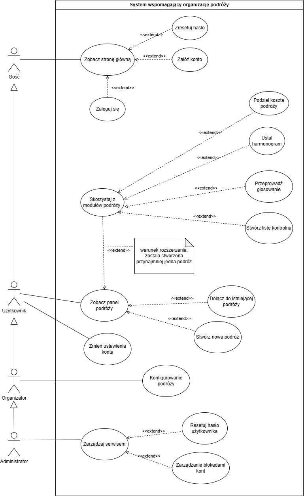

  <h1>Specyfikacja Wymagań</h1>
  <h2>ShareWay</h2>
  <h3>Aplikacja do organizacji wyjazdów grupowych</h3>
  
Wersja: 2.0

  
<strong>Zespół:</strong>

  
Aleksandra Zegler

  
Amelia Hajkowska

  
Mikita Kasevich

  
Stanislau Liatsko

  
Kanstantsin Humianka

<!-- TOC -->
- [1. Wprowadzenie](#1-wprowadzenie)
  - [1.1. Cel dokumentu](#11-cel-dokumentu)
  - [1.2. Zakres​ ​produktu](#12-zakres-produktu)
  - [1.3. Literatura](#13-literatura)
- [2. Opis ogólny](#2-opis-ogólny)
  - [2.1 Perspektywa​ ​produktu](#21-perspektywa-produktu)
  - [2.2. Funkcje​ ​produktu](#22-funkcje-produktu)
  - [2.3. Ograniczenia](#23-ograniczenia)
  - [2.4. Dokumentacja projektu](#24-dokumentacja-projektu)
  - [2.4.1. Stos technologiczny](#241-stos-technologiczny)
  - [2.5. Założenia​ ​i​ ​zależności](#25-założenia-i-zależności)
- [3. Model procesów biznesowych](#3-model-procesów-biznesowych)
  - [3.1. Aktorzy i charakterystyka użytkowników](#31-aktorzy-i-charakterystyka-użytkowników)
  - [3.2. Obiekty biznesowe](#32-obiekty-biznesowe)
- [4. Wymagania​ ​funkcjonalne](#4-wymagania-funkcjonalne)
  - [4.1 Przypadki użycia](#41-przypadki-użycia)
- [5. Charakterystyka interfejsów](#5-charakterystyka-interfejsów)
  - [5.1. Interfejs użytkownika](#51-interfejs-użytkownika)
  - [5.2. Interfejsy zewnętrzne](#52-interfejsy-zewnętrzne)
    - [5.2.1. Interfejsy komunikacyjne](#521-interfejsy-komunikacyjne)
- [6. Wymagania​ ​pozafunkcjonalne](#6-wymagania-pozafunkcjonalne)

<!-- /TOC -->

## 1. Wprowadzenie

### 1.1. Cel dokumentu
Dokument stanowi jedyne źródło wymagań aplikacji ShareWay. Stanowi podstawę dla specyfikacji​ ​oprogramowania.  
Dokument przeznaczony głównie dla zespołu deweloperskiego zajmującego się wytwarzaniem​ ​oprogramowania​ ShareWay.

### 1.2. Zakres​ ​produktu

Celem projektu jest stworzenie systemu informatycznego ShareWay, którego zadaniem będzie **ułatwienie organizacji wyjazdów grupowych** — od etapu planowania podróży, aż po rozliczanie kosztów między uczestnikami.

System zostanie zaprojektowany w sposób modułowy, co umożliwi jego ciągły rozwój i rozbudowę o kolejne funkcjonalności.

Wszystkie dane użytkowników oraz grup będą przechowywane w bazie danych, z zachowaniem zasad bezpieczeństwa i ochrony prywatności.

### 1.3. Literatura

1. Ustawa z dnia 29 sierpnia 1997 r. o ochronie danych osobowych (Dz.U. 1997 nr 133 poz. 883, z późn. zm.).

2. Rozporządzenie Parlamentu Europejskiego i Rady (UE) 2016/679 z dnia 27 kwietnia 2016 r. (RODO) w sprawie ochrony osób fizycznych w związku z przetwarzaniem danych osobowych.

## 2. Opis ogólny

### 2.1 Perspektywa​ ​produktu

System ShareWay to **aplikacja webowa** stworzona, aby wspierać **organizację wyjazdów grupowych**. Jej głównym zadaniem jest **ułatwienie planowania podróży, ustalania harmonogramu, dzielenia kosztów oraz przygotowań** przed wyjazdem. Dzięki temu użytkownicy mają **jedno miejsce** do wspólnego zarządzania wszystkimi informacjami związanymi z podróżą.

Aplikacja **działa w przeglądarce** i **nie wymaga instalacji** dodatkowego oprogramowania. Interfejs został zaprojektowany z myślą o **prostocie i wygodzie**. Dane użytkowników, podróży oraz grup są **zapisywane w bazie danych**, co zapewnia **bezpieczeństwo i spójność** informacji.

System ma **budowę modułową**, co pozwala rozwijać go o nowe funkcje bez zakłócania działania już istniejących elementów. W aplikacji występują role o różnych uprawnieniach: **Gość** (przegląd i rejestracja), **Zalogowany użytkownik** (dostęp do podróży i modułów), **Organizator** (zarządzanie grupą i planem wyjazdu) oraz **Administrator** (nadzór nad całym systemem i dostęp do danych wszystkich użytkowników).

Celem aplikacji jest **ułatwienie współpracy** między uczestnikami wyjazdu — **uporządkowanie komunikacji, organizacji i rozliczeń**, dzięki czemu planowanie staje się prostsze i bardziej przejrzyste.

### 2.2. Funkcje​ ​produktu

Aplikacja wspiera użytkowników na każdym etapie planowania podróży. Po wejściu na stronę główną można się **zarejestrować lub zalogować**. Po zalogowaniu użytkownik przechodzi do panelu, gdzie **tworzy nową podróż** albo **dołącza do istniejącej grupy przy użyciu kodu zaproszenia**.

Każda podróż ma **własny harmonogram**. Użytkownicy dodają **dni, aktywności, godziny i lokalizacje**. Wprowadzone **zmiany są widoczne dla wszystkich uczestników**, co ułatwia wspólne planowanie.

System zawiera **moduł rozliczeń**, który umożliwia **dodawanie wydatków** i **automatycznie oblicza bilans kosztów między członkami** grupy — użytkownik widzi, **kto komu i ile** powinien zwrócić.

Dostępny jest **moduł głosowania** (decyzje dotyczące trasy, atrakcji czy noclegu) oraz **lista kontrolna**, która ułatwia przygotowania do wyjazdu dzięki możliwości dopisywania pozycji i odznaczania wykonanych zadań.

Użytkownik ma dostęp do **ustawień konta** (zmiana danych logowania i informacji profilowych). **Administrator** korzysta z **oddzielnego panelu** do zarządzania użytkownikami, grupami i działaniem systemu. **Moduły są zintegrowane**, co zapewnia **spójność danych i płynność pracy**.

### 2.3. Ograniczenia

System działa **wyłącznie w środowisku przeglądarkowym** i **wymaga stałego połączenia z internetem**. Aplikacja **nie jest dostępna w trybie offline** ani jako **aplikacja mobilna lub desktopowa**.

System jest przeznaczony do użytku w **nowoczesnych przeglądarkach** obsługujących aktualne standardy sieciowe — korzystanie ze starszych wersji może powodować nieprawidłowe wyświetlanie niektórych elementów interfejsu.

**Wydajność aplikacji zależy od szybkości połączenia i mocy urządzenia** — przy wolnym internecie lub starszym sprzęcie mogą występować opóźnienia.

Dostęp do **pełnej funkcjonalności wymaga konta użytkownika**; osoby niezalogowane mają dostęp jedynie do strony głównej i formularza rejestracji.

### 2.4. Dokumentacja projektu

| **Nazwa dokumentu** | **Opis zawartości** | **Format** | **Dostępność** |
|---|---|---|---|
| **Diagramy sekwencji** | Diagramy sekwencji systemu Shareway. | PDF | `Documentation/diagramy_sekwencji_shareway.pdf` |
| **Dokumentacja API (Swagger)** | Interaktywna dokumentacja **endpointów REST API**, schematów DTO, kodów odpowiedzi HTTP. | HTML (Swagger UI) | `/api/docs` |
| **Specyfikacja techniczna** | Architektura systemu, szczegółowa specyfikacja endpointów, modele DTO, mechanizmy autoryzacji (JWT + Redis). | HTML | `Documentation/tech-spec.html` |
| **Specyfikacja wymagań** | Wymagania funkcjonalne i pozafunkcjonalne, przypadki użycia, model biznesowy. | Markdown | Niniejszy dokument |
| **README projektu** | Instrukcja uruchomienia (**Quick Start**), konfiguracja Docker | Markdown | `README.md` |

### 2.4.1. Stos technologiczny

**Backend:**
- **NestJS** (v11) — framework Node.js do budowy skalowalnych aplikacji serwerowych
- **TypeORM** (v0.3) — ORM do zarządzania bazą danych
- **PostgreSQL** (v17) — relacyjna baza danych
- **Redis** (v8) — cache i zarządzanie sesjami/tokenami
- **JWT** (Access & Refresh Tokens) — mechanizm autoryzacji
- **Bcrypt** — hashowanie haseł
- **Passport** — middleware do uwierzytelniania
- **Swagger** — automatyczna dokumentacja API
- **Nodemailer** — wysyłka e-maili

**Frontend:**
- **Next.js** (v16) — framework React z Server-Side Rendering
- **React** (v19) — biblioteka UI
- **TypeScript** — typowanie statyczne
- **Tailwind CSS** (v4) — utility-first CSS framework
- **Formik & Yup** — obsługa formularzy i walidacja
- **Framer Motion** — animacje
- **Radix UI** — komponenty UI
- **Lucide React** — ikony

**Infrastruktura:**
- **Docker & Docker Compose** — konteneryzacja aplikacji
- **Nginx** — API Gateway i reverse proxy
- **MailHog** — środowisko testowe dla e-maili (development)

**Dodatkowe usługi:**
- **Embedding Reranker** (Python/FastAPI) — opcjonalna usługa do inteligentnego wyszukiwania destynacji

**Porty i dostęp do usług (development):**

| Usługa | URL / Port | Opis |
| :--- | :--- | :--- |
| **Frontend** | [http://localhost:3001](http://localhost:3001) | Aplikacja Next.js |
| **API Gateway** | [http://localhost:4000](http://localhost:4000) | Nginx - punkt wejścia do API |
| **API (direct)** | `localhost:4001` | Backend NestJS (wewnętrzny) |
| **PostgreSQL** | `localhost:5432` | Baza danych (port domyślny: 55432) |
| **Redis** | `localhost:6379` | Cache i sesje |
| **MailHog UI** | [http://localhost:8025](http://localhost:8025) | Podgląd e-maili (SMTP: 1025) |
| **Swagger Docs** | [http://localhost:4000/api/docs](http://localhost:4000/api/docs) | Dokumentacja API |

### 2.5. Założenia​ ​i​ ​zależności

System ShareWay został zaprojektowany w **architekturze klient–serwer** z wykorzystaniem **konteneryzacji w Docker**. Dane użytkowników, grup i podróży są **przechowywane w relacyjnej bazie PostgreSQL** i dostępne wyłącznie dla **osób uprawnionych**. Każdy użytkownik posiada **indywidualne konto** dające dostęp do pełnego zakresu funkcji.

**Architektura systemu:**
- **Frontend (Next.js)** — aplikacja webowa działająca w przeglądarce, komunikująca się z backendem przez REST API
- **API Gateway (Nginx)** — punkt wejścia do API, reverse proxy przekierowujący żądania do odpowiednich usług
- **Backend API (NestJS)** — główna logika biznesowa, kontrolery, serwisy i repozytoria
- **Baza danych (PostgreSQL)** — przechowywanie danych użytkowników, podróży, wydatków, głosowań
- **Cache (Redis)** — przechowywanie refresh tokenów, sesji i danych tymczasowych
- **Serwis mailowy (MailHog/SMTP)** — wysyłka powiadomień e-mail

**Mechanizmy bezpieczeństwa:**
- **JWT (JSON Web Tokens)** — access token (15 min) i refresh token (7 dni) przechowywane w httpOnly cookies
- **Bcrypt** — hashowanie haseł z solą (10 rund)
- **Guards NestJS** — kontrola dostępu na poziomie kontrolerów (JwtAuthGuard, RolesGuard, TripAccessGuard)
- **Rate Limiting (Throttler)** — ochrona przed nadmierną liczbą żądań (100 żądań/min)
- **CORS** — konfiguracja dozwolonych źródeł w zależności od środowiska
- **Walidacja danych** — class-validator i class-transformer do walidacji DTO

Założono korzystanie z aplikacji przez przeglądarki internetowe na różnych urządzeniach — interfejs jest **responsywny** i dostosowuje się do rozdzielczości ekranu.

Moduły systemu współpracują w ramach **wspólnego mechanizmu logowania i pracy w grupach**. Dołączanie do podróży odbywa się przy użyciu **unikalnego kodu zaproszenia** generowanego przez system. API udostępnia endpoint **`/api/v1`** zgodny ze standardem REST.

Przewidziano **dalszy rozwój i integracje z zewnętrznymi narzędziami** (np. **kalendarze, mapy, systemy płatności**). System posiada **automatyczną dokumentację API (Swagger)** dostępną pod adresem `/api/docs`. **Dokumentacja użytkownika i techniczna** stanowi integralną część systemu i jest **aktualizowana wraz z jego rozwojem**.

**Struktura modułów backendu (NestJS):**

| Moduł | Odpowiedzialność | Główne encje |
| :--- | :--- | :--- |
| **AuthModule** | Rejestracja, logowanie, JWT, refresh tokeny, reset hasła | - |
| **UsersModule** | Zarządzanie profilami użytkowników | `User` |
| **TripsModule** | Tworzenie podróży, dołączanie, kody zaproszeń, zarządzanie uczestnikami | `Trip`, `Participant` |
| **PlanningModule** | Harmonogram podróży, dni, aktywności | `Day`, `Activity` |
| **FinanceModule** | Wydatki grupowe, rozliczenia, bilanse | `Expense`, `ExpenseDebtor` |
| **EngagementModule** | Głosowania i listy kontrolne | `Vote`, `VoteOption`, `VoteCast`, `ChecklistItem`, `ChecklistItemState` |
| **AdminModule** | Panel administracyjny, zarządzanie użytkownikami i podróżami | - |
| **MailerModule** | Wysyłka e-maili (powitalne, reset hasła, powiadomienia) | - |
| **RedisModule** | Zarządzanie cache i sesjami (refresh tokeny) | - |
| **HealthModule** | Health checks i monitoring systemu | - |

**Struktura frontendu (Next.js):**

| Katalog/Moduł | Opis |
| :--- | :--- |
| **app/(auth)/** | Logowanie, rejestracja, reset hasła |
| **app/dashboard/** | Panel użytkownika, lista podróży |
| **app/dashboard/[groupId]/** | Szczegóły podróży, dostęp do modułów |
| **app/admin/** | Panel administracyjny |
| **app/components/** | Komponenty współdzielone (UI, nawigacja) |
| **app/context/** | Konteksty React (sesja, język, motywy) |
| **lib/** | Utility functions, API client, typy TypeScript |

## 3. Model procesów biznesowych

### 3.1. Aktorzy i charakterystyka użytkowników

**Diagram aktorów:**

**Gość**

| Pole             | Wartość                                                                                                          |
| ---------------- | ---------------------------------------------------------------------------------------------------------------- |
| **ID**           | GUEST                                                                                                            |
| **Nazwa**        | Gość                                                                                                             |
| **Opis**         | Osoba nieposiadająca konta lub niezalogowana. Może przeglądać stronę główną i rozpocząć rejestrację / logowanie. |
| **Uprawnienia**  | • Podgląd strony głównej (landing page) • Dostęp do formularzy rejestracji i logowania • Wysłanie żądania resetowania hasła                                            |
| **Główne akcje** | • Przeglądaj stronę główną • Zarejestruj się (POST /api/v1/auth/register) • Zaloguj się (POST /api/v1/auth/login) • Wyślij żądanie resetu hasła                                   |
| **Ograniczenia** | Brak dostępu do jakichkolwiek modułów aplikacji (podróże, harmonogram, finanse, głosowania). |

**Użytkownik**

| Pole             | Wartość                                                                                                                                                                                          |
| ---------------- | ------------------------------------------------------------------------------------------------------------------------------------------------------------------------------------------------ |
| **ID**           | USER                                                                                                                                                                                             |
| **Nazwa**        | Użytkownik                                                                                                                                                                                       |
| **Opis**         | Osoba z aktywnym kontem po zalogowaniu. Ma pełny dostęp do wszystkich modułów aplikacji w ramach podróży, do których należy.                                                                                           |
| **Uprawnienia**  | • Wszystkie uprawnienia Gościa • Tworzenie nowych podróży • Dołączanie do podróży przez kod • Dostęp do panelów wszystkich podróży, w których uczestnicy • Edycja własnego profilu • Zmiana hasła i e-maila                                                                                                                       |
| **Główne akcje** | • Utwórz podróż (POST /api/v1/trips) • Dołącz do podróży przez kod zaproszenia (POST /api/v1/trips/join) • Dodawanie/edycja dni i aktywości w harmonogramie • Dodawanie wydatków i podgląd rozliczeń • Tworzenie i udział w głosowaniach • Zarządzanie listą kontrolną • Edycja profilu (PATCH /api/v1/users/me) |
| **Ograniczenia** | • Nie może edytować metadanych podróży (chyba że jest organizatorem) • Nie może usuwać innych użytkowników z grupy • Brak dostępu do panelu administracyjnego |

**Organizator**

| Pole             | Wartość                                                                                                                            |
| ---------------- | ---------------------------------------------------------------------------------------------------------------------------------- |
| **ID**           | ORGANIZER                                                                                                                          |
| **Nazwa**        | Organizator                                                                                                                        |
| **Opis**         | Właściciel/administrator konkretnej podróży. Zarządza danymi podróży, kodami zaproszeń i polityką edycji modułów.                  |
| **Uprawnienia**  | Wszystko, co Użytkownik + edycja metadanych podróży; generowanie/odwołanie kodów; moderacja treści w planie.                       |
| **Główne akcje** | • Konfiguruj podróż (nazwa, termin, lokalizacja) • Generuj kod zaproszenia • Ustalaj zasady edycji planu i rozliczeń |

**Administrator systemu**

| Pole             | Wartość                                                                                                    |
| ---------------- | ---------------------------------------------------------------------------------------------------------- |
| **ID**           | ADMIN                                                                                                      |
| **Nazwa**        | Administrator systemu                                                                                      |
| **Opis**         | Rola systemowa z najwyższymi uprawnieniami. Odpowiada za nadzór nad systemem, zarządzanie użytkownikami i grupy, bezpieczeństwo oraz interwencje w przypadku nagłych sytuacji.                                      |
| **Uprawnienia**  | • Wgląd w listę wszystkich użytkowników (GET /api/v1/admin/users) • Wgląd w listę wszystkich podróży (GET /api/v1/admin/trips) • Szczegóły dowolnego użytkownika (GET /api/v1/admin/users/:id) • Blokowanie kont użytkowników (PATCH /api/v1/admin/users/:id/ban) • Odblokowywanie kont (PATCH /api/v1/admin/users/:id/unban)                               |
| **Główne akcje** | • Zarządzaj użytkownikami (ban, unban, promote) • Monitoruj podróże • Rozwiązuj spory/incydenty • Wymuszaj polityki bezpieczeństwa |
| **Dostęp**        | Panel administracyjny dostępny pod `/admin` (wymaga roli ADMIN). Chroniony przez `RolesGuard`. |
| **Uwagi**        | Rola przypisywana ręcznie w bazie danych lub przez innego admina. Nie dziedziczy uprawnień Organizatora do konkretnych podróży. |

**Usługi systemowe**

| Pole             | Wartość                                                                                                                                                             |
| ---------------- | ------------------------------------------------------------------------------------------------------------------------------------------------------------------- |
| **ID**           | SYSTEM                                                                                                                                                              |
| **Nazwa**        | Usługi systemowe                                                                                                                                                    |
| **Opis**         | Zautomatyzowane procesy backendu działające w tle bez bezpośredniego udziału użytkownika. Zapewniają poprawną walidację danych, generowanie tokenów, obliczenia biznesowe i wysyłkę powiadomień.                                                                 |
| **Uprawnienia**  | Operacje serwisowe w ramach logiki biznesowej, bez interakcji z użytkownikiem.                                                                                             |
| **Główne akcje** | • **Walidacja danych**: format e-mail (RFC 5322), siła hasła (regex), poprawność dat, kwot • **Generowanie kodów**: kody zaproszeń (6 znaków alfanumerycznych), tokeny resetu hasła (UUID) • **Obliczenia finansowe**: algorytm minimalizacji długów w rozliczeniach grupowych • **Zarządzanie sesjami**: weryfikacja i odświeżanie JWT tokenów, wygaśnięcie w Redis • **Wysyłka e-maili**: mail powitalny, reset hasła, powiadomienia o zmianach • **Health checks**: monitorowanie stanu bazy, Redis, serwisów |
| **Implementacja** | • Pipes: `ValidationPipe` (class-validator) • Guards: `JwtAuthGuard`, `RolesGuard`, `TripAccessGuard` • Serwisy: `MailerService`, `RedisRepository`, `FinanceService.calculateBalance()` • Event Emitters: `EventEmitter2` dla asynchronicznych zdarzeń |

### 3.2. Obiekty biznesowe

**Podróż (Trip)**

| Pole                         | Wartość                                                                                                                                                                                  |
| ---------------------------- | ---------------------------------------------------------------------------------------------------------------------------------------------------------------------------------------- |
| **Nazwa**                    | Podróż                                                                                                                                                                                   |
| **Opis**                     | Centralny obiekt wyjazdu grupowego zawierający metadane podróży, informacje o uczestnikach oraz powiązane moduły (harmonogram, wydatki, głosowania, lista kontrolna).                                                                                                     |
| **Kluczowe pola** | • ID (UUID) • Nazwa, opis • Termin (startDate, endDate) • Lokalizacja (destination) • Waluta bazowa (baseCurrency, domyślnie PLN) • Status (ACTIVE/ARCHIVED) • Kod zaproszenia (inviteCode, 6 znaków) i data wygaśnięcia • Daty utworzenia/aktualizacji |
| **Powiązane encje**        | • **Participant** (uczestnicy z rolami ORGANIZER/PARTICIPANT) • **Day** (dni harmonogramu) • **Expense** (wydatki) • **Vote** (głosowania) • **ChecklistItem** (lista kontrolna)                                                                                                               |
| **Powiązane procesy**        | Utwórz podróż; Edytuj podróż (tylko organizator); Dołącz do podróży (przez kod); Zarządzanie uczestnikami; Transfer roli organizatora; Archiwizacja.                                                                                                               |
| **Implementacja**            | Encja: `Trip`; Kontroler: `TripsController`; Serwis: `TripsService`; Guard: `TripAccessGuard` |

**Uczestnik podróży (Participant)**

| Pole                  | Wartość                                                                                      |
| --------------------- | -------------------------------------------------------------------------------------------- |
| **Nazwa**             | Uczestnik podróży                                                                               |
| **Opis**              | Reprezentuje uczestnictwo użytkownika w konkretnej podróży. Każdy uczestnik ma przypisaną rolę: **ORGANIZER** (twórca/zarządca podróży) lub **PARTICIPANT** (zwykły uczestnik). |
| **Kluczowe pola**     | • User ID (powiązanie z użytkownikiem) • Trip ID (powiązanie z podróżą) • Rola (ORGANIZER/PARTICIPANT) • Data dołączenia (joinedAt) |
| **Uprawnienia**       | • **ORGANIZER**: edycja metadanych podróży, zarządzanie kodami zaproszeń, usuwanie uczestników, transfer roli • **PARTICIPANT**: dodawanie wydatków, głosowanie, edycja harmonogramu, lista kontrolna |
| **Powiązane procesy** | Dołącz do podróży; Opuść podróż; Zarządzaj członkami (tylko organizator); Transfer roli organizatora.                                 |
| **Implementacja**     | Encja: `Participant`; Relacja many-to-many między User i Trip |

**Zaproszenie**

| Pole                  | Wartość                                                                                           |
| --------------------- | ------------------------------------------------------------------------------------------------- |
| **Nazwa**             | Zaproszenie (Kod zaproszenia)                                                                                       |
| **Opis**              | Kod umożliwiający dołączenie do istniejącej podróży; kontrola dostępu do grupy. Składa się z 6 znaków alfanumerycznych.                   |
| **Kluczowe pola**     | Kod (6-znakowy alfanumeryczny, unikalny), data wygaśnięcia (domyślnie 7 dni od wygenerowania), status (aktywny/wygasły), powiązanie z podróżą (ID). |
| **Powiązane procesy** | Generuj kod (automatycznie przy tworzeniu podróży); Weryfikuj kod (przy dołączaniu użytkownika); Odnów kod (generowanie nowego); Unieważnij kod (przez organizatora).                                                    |
| **Implementacja**     | Pola: `inviteCode`, `inviteCodeExpiry` w encji `Trip` |

**Harmonogram (Plan)**

| Pole                  | Wartość                                                                                       |
| --------------------- | --------------------------------------------------------------------------------------------- |
| **Nazwa**             | Harmonogram (Plan)                                                                            |
| **Opis**              | Struktura dni i aktywości wyjazdu (czas, miejsce, opis), współdzielona w grupie. Każdy dzień może zawierać wiele aktywości.             |
| **Kluczowe pola**     | Dzień (Day): data, kolejność (order); Aktywość (Activity): tytuł, opis, godzina rozpoczęcia (startTime), lokalizacja, kolejność, autor (User ID); daty utworzenia/modyfikacji. |
| **Powiązane procesy** | Dodaj/edytuj dzień (POST/PATCH /trips/:id/days); Usuń dzień (DELETE /days/:dayId - usuwa też wszystkie aktywości); Dodaj/edytuj aktywość (POST/PATCH /activities/:id); Synchronizacja widoków u uczestników (przez odswiezenie strony).             |
| **Implementacja**     | Encje: `Day` (relacja many-to-one z Trip), `Activity` (relacja many-to-one z Day); Kontroler: `PlanningController`; Serwis: `PlanningService` |

**Wydatek**

| Pole                  | Wartość                                                                          |
| --------------------- | -------------------------------------------------------------------------------- |
| **Nazwa**             | Wydatek                                                                          |
| **Opis**              | Pozycja kosztowa wprowadzana przez użytkownika; podstawa rozliczeń. Każdy wydatek może być dzielony między uczestników podroży.              |
| **Kluczowe pola**     | Kwota (Decimal), waluta (domyślnie: baseCurrency podroży), opis, kategoria (opcjonalnie), data; płacący (User ID); lista dłużników (ExpenseDebtor: user ID, kwota do zwrócenia). |
| **Powiązane procesy** | Dodaj wydatek; Edytuj/usuń wydatek; Przelicz bilans; Paginowana lista wydatków.                             |
| **Implementacja**     | Encje: `Expense`, `ExpenseDebtor` (relacja many-to-many z User); Kontroler: `FinanceController`; Serwis: `FinanceService` |

**Rozliczenie**

| Pole                  | Wartość                                                                                |
| --------------------- | -------------------------------------------------------------------------------------- |
| **Nazwa**             | Rozliczenie (Bilans)                                                                            |
| **Opis**              | Wynik bilansowania wydatków: lista transferów „kto → komu → ile” obliczana dynamicznie na podstawie wszystkich wydatków w podroży. System minimalizuje liczbę transakcji.      |
| **Kluczowe pola**     | Lista rozliczeń (debtor: User, creditor: User, amount: Decimal); obliczane w locie (nie przechowywane w bazie). |
| **Powiązane procesy** | Oblicz rozliczenia (endpoint: GET /trips/:id/balance); Wyświetl bilans per użytkownik; Generuj podsumowanie.                               |
| **Implementacja**     | Metoda: `FinanceService.calculateBalance()` - algorytm minimalizacji długów; zwraca JSON z listą wymaganych płatności |

**Głosowanie (Ankieta)**

| Pole                  | Wartość                                                                            |
| --------------------- | ---------------------------------------------------------------------------------- |
| **Nazwa**             | Głosowanie (Ankieta)                                                               |
| **Opis**              | Mechanizm podejmowania decyzji w grupie: propozycje, głosy, wyniki. Uczestnicy mogą głosować na jedną opcję lub zmieniać swój głos.                |
| **Kluczowe pola**     | Tytuł, opis (opcjonalnie); lista opcji (VoteOption); głosy (VoteCast: user, option); data utworzenia; autor; status (aktywne/zamknięte). |
| **Powiązane procesy** | Utwórz głosowanie; Głosuj (POST /votes/:voteId/cast); Zmień głos; Cofnij głos (DELETE); Dodaj opcję (POST /votes/:voteId/options); Edytuj/usuń głosowanie; Zlicz wyniki (obliczane dynamicznie).                                           |
| **Implementacja**     | Encje: `Vote`, `VoteOption`, `VoteCast`; Kontroler: `EngagementController`; Serwis: `EngagementService` |

**Pozycja listy kontrolnej**

| Pole                  | Wartość                                                                                |
| --------------------- | -------------------------------------------------------------------------------------- |
| **Nazwa**             | Pozycja listy kontrolnej                                                               |
| **Opis**              | Element wspólnej checklisty; status odhaczenia (completed) jest lokalny dla każdego użytkownika (per-user state). Wszyscy widzą wszystkie pozycje, ale każdy odznacza je osobno.           |
| **Kluczowe pola**     | Tytuł, opis (opcjonalnie); autor (User ID); data utworzenia; lista statusów (ChecklistItemState: user ID, completed: boolean). |
| **Powiązane procesy** | Dodaj pozycję (POST /trips/:id/checklist); Odhacz/odznacz (PATCH /checklist/:itemId/status - tylko dla zalogowanego użytkownika); Przeglądaj listę (GET /trips/:id/checklist); Usuń pozycję (DELETE).                                       |
| **Implementacja**     | Encje: `ChecklistItem`, `ChecklistItemState` (relacja many-to-many z User); Kontroler: `EngagementController` |

**Profil użytkownika (User)**

| Pole                  | Wartość                                                                                            |
| --------------------- | -------------------------------------------------------------------------------------------------- |
| **Nazwa**             | Użytkownik                                                                                 |
| **Opis**              | Podstawowa encja reprezentująca konto użytkownika w systemie. Zawiera dane logowania, informacje profilowe oraz uprawnienia systemowe. |
| **Kluczowe pola**     | • ID (UUID) • E-mail (unikalny, walidowany wg RFC 5322) • Hasło (hash bcrypt, 10 rund) • Pseudonim (nickname) • Rola (USER/ADMIN) • Status konta (ACTIVE/BANNED) • Token resetu hasła (resetToken, resetTokenExpiry) • Daty utworzenia/aktualizacji |
| **Bezpieczeństwo**    | Hasła hashowane przez bcrypt; tokeny JWT przechowywane w Redis; walidacja siły hasła (min. 8 znaków, 1 wielka, 1 mała, 1 cyfra, 1 znak specjalny). |
| **Powiązane procesy** | Rejestracja; Logowanie; Edycja profilu; Zmiana hasła; Reset hasła przez e-mail; Zarządzanie przez admina (ban/unban).                                      |
| **Implementacja**     | Encja: `User`; Kontroler: `UsersController`, `AuthController`; Serwis: `UsersService`, `AuthService` |

**Kod zaproszenia (Invite Code)**

| Pole                  | Wartość                                                                                           |
| --------------------- | ------------------------------------------------------------------------------------------------- |
| **Nazwa**             | Kod zaproszenia                                                                                       |
| **Opis**              | Unikalny kod alfanumeryczny generowany przy tworzeniu podróży, umożliwiający dołączenie nowych uczestników.                   |
| **Kluczowe pola**     | Kod (6-znakowy alfanumeryczny), data wygaśnięcia (domyślnie 7 dni), status (aktywny/wygasły), powiązanie z podróżą. |
| **Powiązane procesy** | Generuj kod (przy tworzeniu podróży); Weryfikuj kod (przy dołączaniu); Odnów kod; Unieważnij kod.                                                    |
| **Implementacja**     | Pole w encji `Trip`, generowane przez `TripsService.generateInviteCode()` |

## 4. Wymagania​ ​funkcjonalne

Wymagania funkcjonalne zostały przedstawione na diagramie przypadków użycia. Są na nim przedstawione funkcjonalności, odpowiadające poszczególnym aktorom systemu. W systemie zdefiniowano następujących aktorów (patrz sekcja 3.1): Gość, Użytkownik, Organizator oraz Administrator systemu.

Zależność między aktorami przedstawia się następująco:

* Użytkownik posiada wszystkie funkcjonalności Gościa,
* Organizator posiada wszystkie funkcjonalności Użytkownika.
* Administrator systemu (Admin) jest odrębną rolą z osobnym zestawem uprawnień. Jego zadania koncentrują się na zarządzaniu całym serwisem.

**Aktorzy główni:**

* Gość 
* Użytkownik  (w tym rola Organizatora jako specjalizacja Użytkownika w kontekście podróży)
* Admin

### 4.1 Przypadki użycia

| ID:                     | **Homepage**      |
| ------                  | ------------------|
| Nazwa:                  | **Strona główna** |
| **Aktorzy główni:**     | Wszyscy |
| **Aktorzy pomocniczy:** | brak    |
| **Poziom:**             | Użytkownika |
| **Priorytet:**          | P0 |
| **Opis:**               | Ekran powitalny aplikacji zawierający opis systemu, jego funkcje oraz opcje do wyboru. |
| **Wyzwalacze:**         | **1.** Admin uruchamia interfejs systemu. |
| **Warunki początkowe:** | **1.** Brak |
| **Warunki końcowe:**    | **1.** Gość widzi zawartość strony głównej |
| **Scenariusz główny:**  | **1.** Gość uruchamia interfejs systemu.   **2.** System wyświetla stronę główną zawierającą:   a. Opcję "Zarejestruj się"   b. Opcję "Zaloguj się "  c. Opis funkcjonalności aplikacji. |
| **Scenariusze alternatywne:** | Brak |
| **Wyjątki:**                  | Brak |
| **Dodatkowe wymagania:**      | Brak |

| ID:                     | Register                 |
| ------                  | ------------------------ |
| Nazwa:                  | **Rejestracja nowego konta** |
| **Aktorzy główni:**     | Gość |
| **Poziom:**             | Użytkownika |
| **Priorytet:**          | P0 |
| **Opis:**               | Gość zakłada nowe konto, aby uzyskać dostęp do funkcji aplikacji i móc tworzyć lub dołączać do grup podróżnych. |
| **Wyzwalacze:**         | **1.** Gość wybiera opcję „Zarejestruj się”. |
| **Warunki początkowe:** | Brak |
| **Warunki końcowe:**    | Konto użytkownika zostało zarejestrowane w systemie. |
| **Scenariusz główny:**  | **1.** Gość wybiera opcję „Zarejestruj się”.   **2.** System wyświetla formularz rejestracji konta.   **3.** Gość wypełnia formularz następującymi danymi:   a. e-mail,   b. hasło,   c. potwierdzenie hasła,   d. pseudonim   **4.** Gość zatwierdza formularz.   **5.** System tworzy konto.   **6.** System wyświetla potwierdzenie rejestracji konta Gościowi. |
| **Scenariusze alternatywne:** | Brak |
| **Wyjątki:**                  | **1.** Adres e-mail istnieje już w systemie.   a. System wyświetla informację o duplikacie.   b. System wyświetla ponownie formularz rejestracji.   **2.** Hasło oraz powtórzone hasło nie są identyczne.   a. System wyświetla informację o niepasujących hasłach   b. System ponownie wyświetla formularz rejestracji.   **3.** Hasło nie spełnia wymagań bezpieczeństwa.   a. System wyświetla informację o zbyt słabym haśle.   b. System ponownie wyświetla formularz rejestracji.|
| **Dodatkowe wymagania:**     | **1.** Format​ ​adresu​ ​e-mail​ ​musi​ ​być​ ​sprawdzany​ ​pod​ ​względem​ ​zgodności​ ​z​ ​RFC​ ​5322.   **2.** Hasło​ ​oraz​ ​powtórzone​ ​hasło​ ​musi​ ​być​ ​sprawdzane​ ​czy​ ​są​ ​identyczne.   **3.** Hasło musi być sprawdzane czy zawiera przynajmniej 8 znaków, 1 cyfrę, 1 wielką i 1 małą literę​ ​oraz​ ​znak​ ​specjalny. |

| ID:    | Login                    |
| ------ | ------------------------ |
| Nazwa: | **Logowanie do systemu**     |
| **Aktorzy główni:** | Użytkownik |
| **Poziom:** | Użytkownika |
| **Priorytet:** | P0 |
| **Opis:** | Użytkownik loguje się, aby uzyskać dostęp do swoich grup podróżnych i funkcji aplikacji. |
| **Wyzwalacze:** | **1.** Użytkownik wybiera „Zaloguj się”. |
| **Warunki początkowe:** | Konto użytkownika istnieje. |
| **Warunki końcowe:** | Użytkownik jest zalogowany i ma dostęp do funkcji aplikacji. |
| **Scenariusz główny:** | **1.** Użytkownik wybiera „Zaloguj się”.   **2.** Wprowadza e-mail i hasło.   **3.** System weryfikuje dane.   **4.** Po poprawnym logowaniu użytkownik zostaje przekierowany do swojego panelu. |
| **Scenariusze alternatywne:** | Brak. |
| **Wyjątki:** | **1.** Nieprawidłowy e-mail lub hasło.   a. System wyświetla komunikat o błędzie.   b. System wyświetla ponownie formularz logowania. |
| **Dodatkowe wymagania:** | Ze względów bezpieczeństwa, system nie może informować Gościa, które pole formularza zawiera błąd. Komunikat powinien być ogólny np. "Błędny login lub/i hasło".|

| ID:    | ForgotPassword           |
| ------ | ------------------------ |
| Nazwa: | **Reset hasła**     |
| **Aktorzy główni:** | Gość / Użytkownik |
| **Poziom:** | Użytkownika |
| **Priorytet:** | P1 |
| **Opis:** | Użytkownik, który zapomniał hasła, może je zresetować przy użyciu linku wysłanego na e-mail. |
| **Wyzwalacze:** | **1.** Użytkownik wybiera „Nie pamiętam hasła". |
| **Warunki początkowe:** | Konto użytkownika istnieje w systemie. |
| **Warunki końcowe:** | Użytkownik ustawił nowe hasło. |
| **Scenariusz główny:** | **1.** Użytkownik wybiera „Nie pamiętam hasła".   **2.** Wprowadza adres e-mail.   **3.** System generuje unikalny token resetowania i wysyła link na e-mail.   **4.** Użytkownik klika w link i zostaje przekierowany na stronę resetowania hasła.   **5.** Wprowadza nowe hasło i potwierdza je.   **6.** System weryfikuje token i aktualizuje hasło. |
| **Wyjątki:** | **1.** E-mail nie istnieje w systemie.   a. System wyświetla ogólny komunikat (ze względów bezpieczeństwa nie ujawnia, czy e-mail istnieje).   **2.** Token wygasł lub jest nieprawidłowy.   a. System wyświetla komunikat o nieważnym linku i prosi o ponowne wysłanie.   **3.** Nowe hasło nie spełnia wymagań bezpieczeństwa.   a. System wyświetla informację o zbyt słabym haśle. |
| **Dodatkowe wymagania:** | **1.** Token resetowania hasła powinien być ważny przez 1 godzinę.   **2.** Token może być użyty tylko raz.   **3.** Hasło musi spełniać wymagania: min. 8 znaków, 1 wielka litera, 1 mała litera, 1 cyfra, 1 znak specjalny. |

| ID:    | CreateTrip               |
| ------ | ------------------------ |
| Nazwa: | **Utwórz nową podróż**       |
| **Aktorzy główni:** | Użytkownik |
| **Poziom:** | Użytkownika |
| **Priorytet:** | P0 |
| **Opis:** | Użytkownik tworzy nową podróż i ustala jej podstawowe parametry, takie jak nazwa, termin, lokalizacja. |
| **Wyzwalacze:** | **1.** Użytkownik klika przycisk "Create".|
| **Warunki początkowe:** | Użytkownik jest zalogowany. |
| **Warunki końcowe:** | Nowa grupa podróżna została utworzona. |
| **Scenariusz główny:** | **1.** Użytkownik wybiera „Utwórz podróż”.   **2.** Wypełnia formularz: nazwa, termin, lokalizacja.   **3.** Użytkownik klika "Zapisz", aby zapisać formularz.   **4.** System zapisuje podróż i generuje unikalny kod zaproszenia. |
| **Scenariusze alternatywne:** | Brak. |
| **Wyjątki:** | **1.** Brak wymaganych danych.   a. System prosi o uzupełnienie pól. |
| **Dodatkowe wymagania:** | System powinien umożliwiać organizatorowi późniejszą edycję danych podróży. |

| ID:    | JoinTrip                      |
| ------ | ----------------------------- |
| Nazwa: | **Dołącz do istniejącej podróży** |
| **Aktorzy główni:** | Użytkownik |
| **Poziom:** | Użytkownika |
| **Priorytet:** | P0 |
| **Opis:** | Użytkownik dołącza do istniejącej grupy podróżnej poprzez wprowadzenie kodu zaproszenia. |
| **Wyzwalacze:** | **1.** Użytkownik klika przycisk "Join".|
| **Warunki początkowe:** | Użytkownik jest zalogowany. |
| **Warunki końcowe:** | Użytkownik pomyślnie dołączył do grupy podróżnej. |
| **Scenariusz główny:** | **1.** Użytkownik wybiera „Dołącz do podróży”.   **2.** Wpisuje kod zaproszenia.   **3.** System weryfikuje kod.   **4.** Jeśli poprawny, użytkownik zostaje dodany do grupy. |
| **Wyjątki:** | **1.** Kod niepoprawny.   a. System wyświetla komunikat o błędzie. |
| **Dodatkowe wymagania:** | Kod zaproszenia powinien być unikalny. |

| ID:    | ViewTrip               |
| ------ | ------------------------ |
| Nazwa: | **Panel podróży**     |
| **Aktorzy główni:** | Użytkownik |
| **Poziom:** | Użytkownika |
| **Priorytet:** | P0 |
| **Opis:** | Podgląd podróży. |
| **Wyzwalacze:** | Użytkownik został zalogowany do systemu i znajduje się w panelu podróży. |
| **Warunki początkowe:** | Użytkownik jest zalogowany. |
| **Warunki końcowe:** | Użytkownik widzi aktualną listę grup podróżowych, których jest uczestnikiem. |
| **Scenariusz główny:** | **1.** Użytkownik loguje się do systemu.   **2.** Użytkownik widzi listę grup podróżnych. |
| **Scenariusz alternatywny** | **1.** Użytkownik nie należy do żadnej grupy.   a. System wyświetla informację "Nie należysz do żadnej grupy podróżnej". |
| **Scenariusz alternatywny** | **1.** Użytkownik znajduje się w module podróży.   a. Użytkownik klika "Powróć".   b. Użytkownik znajduje się w panelu podglądu podróży. |
| **Scenariusz alternatywny** | **1.** Użytkownik, który stworzył podróż klika ikonę edycji.   **2.** Edytuje dane wybranej podróży.   **3.** Zapisuje zmiany.   **4.** Dane podróży zostały zmienione. |
| **Wyjątki:**           | Brak |
| **Dodatkowe wymagania:** | **1.** Użytkownik może kliknąć na daną grupę podróżną, aby zyskać dostęp do modułów dotyczących danej podróży.   **2.** Użytkownik, który stworzył podróż ma uprawnienia do jej edycji. |

| ID:    | AdminPanel               |
| ------ | ------------------------ |
| Nazwa: | **Panel admina**     |
| **Aktorzy główni:** | Admin |
| **Poziom:** | Użytkownika |
| **Priorytet:** | P1 |
| **Opis:** | Admin zarządza danymi użytkowników oraz grup podróżnych. |
| **Wyzwalacze:** | **1.** Użytkownik z rolą admina loguje się do systemu i wybiera opcję przejścia do panelu administracyjnego. |
| **Warunki początkowe:** | **1.** Użytkownik posiada uprawnienia administracyjne (rola admin). **2.** Użytkownik jest zalogowany w systemie. |
| **Warunki końcowe:** | Zmiany dokonane przez administratora zostały zapisane i są widoczne dla pozostałych użytkowników. |
| **Scenariusz główny:** | **1.** Administrator wybiera sekcję (lista użytkowników, lista grup). **2.** Dokonuje wymaganych zmian administracyjnych, np. edytuje dane użytkownika lub grupy. **3.** Zapisuje zmiany. **4.** System potwierdza zapis zmian. |
| **Wyjątki:** |  **1.** Brak uprawnień administratora   a. System nie umożliwia dostępu do listy użytkowników i wyświetla komunikat o braku uprawnień. **2.** Błąd zapisu zmian  a. System wyświetla komunikat o niepowodzeniu operacji (razem z ewentualnym wytłumaczeniem, np. hasło nie spełnia wymogów bezpieczeństwa).|
| **Dodatkowe wymagania:** | **1.** Dostęp wyłącznie dla użytkowników z rolą admina.  **2.** Panel powinien umożliwiać szybkie wyszukiwanie i filtrowanie użytkowników oraz grup.|

| ID:    | Settings                 |
| ------ | ------------------------ |
| Nazwa: | **Zarządzanie ustawieniami** |
| **Aktorzy główni:** | Użytkownik |
| **Poziom:** | Użytkownika |
| **Priorytet:** | P1 |
| **Opis:** | Użytkownik edytuje dane dotyczące jego konta. |
| **Wyzwalacze:** | Użytkownik klika "Ustawienia". |
| **Warunki początkowe:** | Użytkownik jest zalogowany. |
| **Warunki końcowe:** | Użytkownik zmienił ustawienia. |
| **Scenariusz główny:** | **1.** Użytkownik otwiera ustawienia konta.   **2.** Edytuje dane i zapisuje zmiany.   3. System aktualizuje profil i zapisuje konfigurację. |
| **Wyjątki:**             | **1.** Użytkownik chce zmienić e-mail na już istniejący w systemie.   a. System wyświetla informację o duplikacie.   **2.** Użytkownik podczas zmiany hasła, niepoprawnie wpisał powtórzenie hasła.   a. System wyświetla informację o niepasujących hasłach.   **3.** Użytkownik chce zmienić hasło na niespełniające wymagań bezpieczeństwa.   a. System wyświetla informację  o zbyt słabym haśle.  
| **Dodatkowe wymagania:** | Zmiana adresu e-mail lub hasła wymaga potwierdzenia aktualnych danych. |

| ID:    | VotingModule             |
| ------ | ------------------------ |
| Nazwa: | **Głosowanie**              |
| **Aktorzy główni:** | Użytkownik |
| **Poziom:** | Użytkownika |
| **Priorytet:** | P1 |
| **Opis:** | Moduł umożliwia użytkownikom grupy przeprowadzanie głosowań. |
| **Wyzwalacze:** | Użytkownik przechodzi do modułu "Głosowanie". |
| **Warunki początkowe:** | Użytkownik jest zalogowany i jest członkiem co najmniej jednej grupy. |
| **Warunki końcowe:** | Użytkownik korzysta z modułu głosowania. |
| **Scenariusz główny:** | **1.** Użytkownik tworzy głosowanie, dodając propozycje.   **2.** Członkowie grupy oddają głosy.   **3.** System aktualizuje wyniki. |
| **Wyjątki:**                  | Brak |
| **Dodatkowe wymagania:** | **1.** Możliwość dodawania nowych opcji głosowania w trakcie trwania ankiety.   **2.** W danym głosowaniu, można oddać głos tylko raz.   **3.** W danym głosowaniu można zmienić swój głos.|

| ID:    | PlanningModule           |
| ------ | ------------------------ |
| Nazwa: | **Planowanie wyjazdu**       |
| **Aktorzy główni:** | Użytkownik |
| **Poziom:** | Użytkownika |
| **Priorytet:** | P1 |
| **Opis:** | Moduł umożliwia planowanie harmonogramu podróży – dodawanie dni, aktywności, godzin i lokalizacji. |
| **Wyzwalacze:** | Użytkownik przechodzi do modułu "Planowanie" |
| **Warunki początkowe:** | Użytkownik jest zalogowany i jest członkiem co najmniej jednej grupy. |
| **Warunki końcowe:** | Użytkownik korzysta z modułu planowania. |
| **Scenariusz główny:** | **1.** Użytkownik otwiera moduł planowania.   **2.** Dodaje kolejne dni i aktywności.   **3.** System zapisuje plan i udostępnia go wszystkim uczestnikom grupy. |
| **Wyjątki:**                  | Brak |
| **Dodatkowe wymagania:** | System powinien umożliwiać edycję planu wszystkim użytkownikom. |

| ID:    | CostSharingModule        |
| ------ | ------------------------ |
| Nazwa: | **Podział kosztów**          |
| **Aktorzy główni:** | Użytkownik |
| **Poziom:** | Użytkownika |
| **Priorytet:** | P1 |
| **Opis:** | Moduł umożliwia użytkownikom wprowadzanie wydatków oraz automatyczne podsumowuje koszty i rozliczenia. |
| **Wyzwalacze:** | Użytkownik przechodzi do modułu "Podział kosztów" |
| **Warunki początkowe:** | Użytkownik jest zalogowany i jest członkiem co najmniej jednej grupy. |
| **Warunki końcowe:** | Użytkownik korzysta z modułu podziału kosztów. |
| **Scenariusz główny:** | **1.** Użytkownik dodaje nowy wydatek (kwota, opis, kto zapłacił).   **2.** System aktualizuje bilans dla każdego uczestnika.   **3.** Użytkownicy widzą podsumowanie kosztów i rozliczeń. |
| **Wyjątki:**                  | Brak |
| **Dodatkowe wymagania:** | Każdy użytkownik powinien widzieć swoje osobne rozliczenia. (co i ile jest komu winien.) |

| ID:    | ChecklistModule          |
| ------ | ------------------------ |
| Nazwa: | **Lista kontrolna**          |
| **Aktorzy główni:** | Użytkownik |
| **Poziom:** | Użytkownika |
| **Priorytet:** | P1 |
| **Opis:** | Moduł pozwala uczestnikom tworzyć wspólną listę rzeczy do zabrania lub zadań do wykonania przed podróżą. |
| **Wyzwalacze:** | Użytkownik przechodzi do modułu "Lista kontrolna" |
| **Warunki początkowe:** | Użytkownik jest zalogowany i jest członkiem co najmniej jednej grupy. |
| **Warunki końcowe:** | Użytkownik korzysta z modułu listy kontrolnej. |
| **Scenariusz główny:** | **1.** Użytkownik otwiera listę kontrolną.   **2.** Dodaje nowe pozycje (np. „ładowarka”, „namiot”).   **3.** Członkowie grupy mogą odznaczać wykonane pozycje. |
| **Wyjątki:**                  | Brak |
| **Dodatkowe wymagania:** | **1.** Każdy użytkownik może dodawać nowe pozycje do listy.   **2.** Odznaczenie wykonanych pozycji jest widoczne tylko dla danego użytkownika, nie dla wszystkich. |

## 5. Charakterystyka interfejsów

### 5.1. Interfejs użytkownika

| ID | Wymaganie | Priorytet |
| :--- | :--- | :--- |
| **UI1** | System musi posiadać interfejs w języku polskim i angielskim. | **P0** |
| **UI2** | Interfejs aplikacji musi być responsywny (RWD - Responsive Web Design), umożliwiając ergonomiczne korzystanie z systemu zarówno na urządzeniach mobilnych (smartfony, tablety), jak i komputerach stacjonarnych. | **P0** |
| **UI3** | Interfejs powinien weryfikować poprawność danych wprowadzanych w formularzach w czasie rzeczywistym (walidacja po stronie klienta), przed wysłaniem ich do serwera (np. format adresu e-mail, zgodność haseł, poprawność formatu kwot w module kosztów). | **P0** |
| **UI4** | Kluczowe moduły interaktywne (Głosowanie, Lista kontrolna, Planowanie) powinny działać asynchronicznie, aktualizując wyświetlane dane dynamicznie bez konieczności pełnego przeładowania strony. | **P1** |
| **UI5** | W module "Podział kosztów" każdy użytkownik powinien wyraźnie widzieć, ile pieniędzy ma do oddania innym, a ile inni mają do oddania jemu (np. "Jesteś winien: 50 zł", "Tobie winni: 120 zł"). |**P1** || **UI6** | System powinien wyświetlać czytelne komunikaty błędów oraz potwierdzenia wykonania akcji (np. "Podróż została utworzona pomyślnie"). | **P1** |

### 5.2. Interfejsy zewnętrzne

#### 5.2.1. Interfejsy komunikacyjne

System udostępnia interfejs programistyczny aplikacji (REST API), który stanowi warstwę pośredniczącą między frontendem (interfejsem użytkownika) a bazą danych i logiką biznesową po stronie serwera.

**Architektura API:**
- **Endpoint bazowy:** `/api/v1` (wersjonowanie API)
- **Protokół:** HTTPS (produkcja), HTTP (development)
- **Metody HTTP:** GET, POST, PATCH, DELETE
- **Format danych:** JSON (Content-Type: application/json)
- **Autoryzacja:** JWT Bearer Token w httpOnly cookies
- **Rate Limiting:** 100 żądań/minutę

**Główne grupy endpointów:**

1. **Autentykacja (`/api/v1/auth`)**
   - `POST /register` — rejestracja nowego użytkownika
   - `POST /login` — logowanie (zwraca access i refresh token)
   - `POST /logout` — wylogowanie (usuwa refresh token)
   - `POST /refresh` — odświeżenie access tokena
   - `POST /forgot-password` — reset hasła (wysyłka emaila)
   - `POST /reset-password` — ustawienie nowego hasła

2. **Użytkownicy (`/api/v1/users`)**
   - `GET /me` — dane zalogowanego użytkownika
   - `PATCH /me` — aktualizacja profilu
   - `PATCH /me/password` — zmiana hasła

3. **Podróże (`/api/v1/trips`)**
   - `POST /` — utworzenie nowej podróży
   - `GET /` — lista podróży użytkownika
   - `GET /:id` — szczegóły podróży
   - `PATCH /:id` — edycja podróży (tylko organizator)
   - `DELETE /:id` — usunięcie podróży (tylko organizator)
   - `POST /join` — dołączenie do podróży przez kod
   - `POST /:id/invite-code` — generowanie nowego kodu zaproszenia
   - `DELETE /:id/invite-code` — unieważnienie kodu zaproszenia

4. **Planowanie (`/api/v1/planning`)**
   - `GET /trips/:id/plan` — harmonogram podróży
   - `POST /trips/:id/days` — dodanie dnia do planu
   - `DELETE /days/:dayId` — usunięcie dnia
   - `POST /days/:dayId/activities` — dodanie aktywności
   - `PATCH /activities/:id` — edycja aktywności
   - `DELETE /activities/:id` — usunięcie aktywności

5. **Finanse (`/api/v1/finance`)**
   - `POST /trips/:id/expenses` — dodanie wydatku
   - `GET /trips/:id/expenses` — lista wydatków (paginowana)
   - `PATCH /expenses/:id` — edycja wydatku
   - `DELETE /expenses/:id` — usunięcie wydatku
   - `GET /trips/:id/balance` — rozliczenia grupy

6. **Głosowanie i listy kontrolne (`/api/v1/engagement`)**
   - **Głosowania:**
     - `POST /trips/:id/votes` — utworzenie głosowania
     - `GET /trips/:id/votes` — lista głosowań
     - `POST /votes/:voteId/cast` — oddanie głosu
     - `DELETE /votes/:voteId/cast` — cofnięcie głosu
     - `PATCH /votes/:id` — edycja głosowania
     - `DELETE /votes/:id` — usunięcie głosowania
     - `POST /votes/:voteId/options` — dodanie opcji
   - **Listy kontrolne:**
     - `GET /trips/:id/checklist` — lista zadań
     - `POST /trips/:id/checklist` — dodanie zadania
     - `PATCH /checklist/:itemId/status` — zmiana statusu
     - `DELETE /checklist/:itemId` — usunięcie zadania

7. **Administracja (`/api/v1/admin`)** *(tylko dla roli ADMIN)*
   - `GET /users` — lista wszystkich użytkowników (paginowana)
   - `GET /users/:id` — szczegóły użytkownika
   - `PATCH /users/:id/ban` — zablokowanie użytkownika
   - `PATCH /users/:id/unban` — odblokowanie użytkownika
   - `POST /users/:id/promote` — nadanie roli ADMIN

**Dokumentacja API:**
- **Swagger UI:** dostępny pod adresem `/api/docs` (automatyczna dokumentacja)
- **Format odpowiedzi:** JSON z polami `data`, `message`, `error`
- **Kody HTTP:**
  - `200 OK` — sukces
  - `201 Created` — zasób utworzony
  - `400 Bad Request` — błędne dane wejściowe
  - `401 Unauthorized` — brak autoryzacji
  - `403 Forbidden` — brak uprawnień
  - `404 Not Found` — zasób nie znaleziony
  - `500 Internal Server Error` — błąd serwera

## 6. Wymagania​ ​pozafunkcjonalne

| Nazwa | Priorytet | Opis |
| :--- | :--- | :--- |
| **Bezpieczeństwo haseł** | **P0** | Hasła użytkowników muszą być przechowywane w bazie danych wyłącznie w postaci zaszyfrowanej przy użyciu **bcrypt** (10 rund saltowania). Niedopuszczalne jest przechowywanie haseł jako tekst jawny. |
| **Ochrona danych i prywatność** | **P0** | System musi być zaprojektowany zgodnie z zasadami **RODO**. Dane jednej grupy podróżnej (plany, koszty, dyskusje) nie mogą być w żaden sposób dostępne dla użytkowników spoza tej grupy. Każde żądanie do API jest weryfikowane przez **TripAccessGuard**. |
| **Autoryzacja i uwierzytelnianie** | **P0** | System używa **JWT** (JSON Web Tokens): **access token** (15 minut) do autoryzacji żądań, **refresh token** (7 dni) do odnawiania sesji. Tokeny przechowywane w **httpOnly cookies** (zabezpieczenie przed XSS). Refresh tokeny składowane w **Redis** z możliwością unieważnienia. |
| **Rate Limiting** | **P0** | Aplikacja wykorzystuje **Throttler** do ochrony przed atakami DDoS — maksymalnie **100 żądań na minutę** na użytkownika. |
| **Walidacja danych** | **P0** | Wszystkie dane wejściowe są walidowane po stronie backendu przy użyciu **class-validator** i **DTO** (Data Transfer Objects). Walidacja formatu e-mail według RFC 5322, walidacja mocy hasła (min. 8 znaków, 1 wielka litera, 1 mała litera, 1 cyfra, 1 znak specjalny). |
| **CORS i zabezpieczenia nagłówków** | **P0** | System konfiguruje **CORS** zgodnie ze środowiskiem (development: wszystkie originy, production: tylko dozwolone domeny). Wykorzystanie **helmet.js** do zabezpieczenia nagłówków HTTP. |
| **Wydajność modułów asynchronicznych** | **P1** | Aktualizacje w modułach współdzielonych (Głosowanie, Lista kontrolna, Planowanie) powinny być widoczne dla innych użytkowników po odświeżeniu strony. System korzysta z **cache Redis** dla często używanych danych. |
| **Kompatybilność przeglądarek** | **P0** | Aplikacja musi poprawnie funkcjonować i wyświetlać się w dwóch ostatnich stabilnych wersjach głównych przeglądarek: Google Chrome, Mozilla Firefox, Safari oraz Microsoft Edge. |
| **Skalowalność i obciążenie** | **P1** | System zaprojektowany w **architekturze mikroserwisów** z wykorzystaniem **Docker Compose**. Backend zbudowany w **NestJS** z modułową strukturą, co umożliwia skalowanie horyzontalne. Baza **PostgreSQL** z indeksami na kluczowych polach. **Redis** dla cache i sesji. |
| **Dostępność systemu (Uptime)** | **P1** | System powinien zapewniać dostępność usług na poziomie 99.5% czasu, z wyłączeniem planowanych okien serwisowych. Wykorzystanie **health checks** w Docker Compose oraz endpoint `/health` do monitorowania stanu aplikacji. |
| **Powiadomienia systemowe** | **P2** | System wysyła powiadomienia e-mail o kluczowych zdarzeniach: potwierdzenie rejestracji, reset hasła, zmiana hasła. W środowisku development wykorzystywany jest **MailHog** (testowy serwer SMTP). Szablony e-maili oparte na **Handlebars**. |
| **Logowanie i monitoring** | **P1** | System loguje kluczowe wydarzenia (błędy, próby logowania, zmiany danych) przy użyciu wbudowanego **Logger** w NestJS. Różne poziomy logowania w zależności od środowiska (development: verbose, production: error/warn). |
| **Backup i odzyskiwanie danych** | **P1** | Regularne backupy bazy PostgreSQL. Docker volumes dla persystencji danych (`postgres_data`, `redis_data`). |
| **Wersjonowanie API** | **P0** | API wykorzystuje prefix `/api/v1` umożliwiający przyszłe wersjonowanie bez łamania kompatybilności wstecznej. |
| **Dokumentacja API** | **P1** | Automatyczna dokumentacja **Swagger** dostępna pod `/api/docs`, generowana na podstawie dekoratorów NestJS. |
