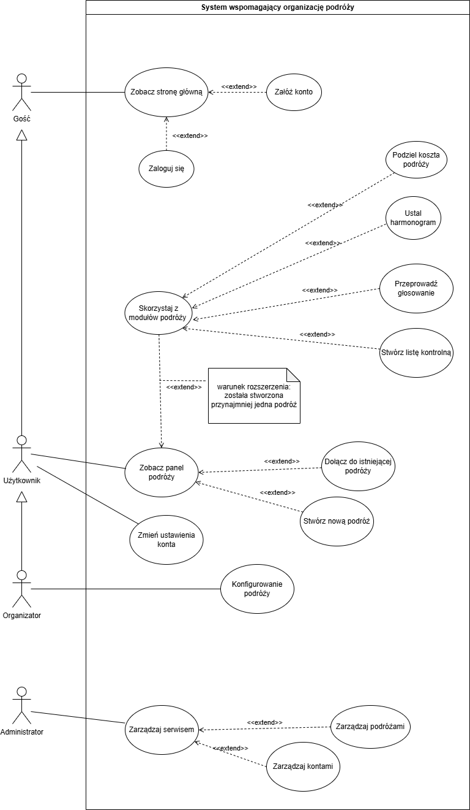

  <h1>Specyfikacja Wymagań</h1>
  <h2>DLA SHAREWAY</h2>
  
Wersja: 1.0

<!-- TOC -->
- [1. Wprowadzenie](#1-wprowadzenie)
  - [1.1. Cel dokumentu](#11-cel-dokumentu)
  - [1.2. Zakres​ ​produktu](#12-zakres-produktu)
  - [1.3. Literatura](#13-literatura)
- [2. Opis ogólny](#2-opis-ogólny)
  - [2.1 Perspektywa​ ​produktu](#21-perspektywa-produktu)
  - [2.2. Funkcje​ ​produktu](#22-funkcje-produktu)
  - [2.3. Ograniczenia](#23-ograniczenia)
  - [2.4. Dokumentacja​ ​użytkownika](#24-dokumentacja-użytkownika)
  - [2.5. Założenia​ ​i​ ​zależności](#25-założenia-i-zależności)
- [3. Model procesów biznesowych](#3-model-procesów-biznesowych)
  - [3.1. Aktorzy​ ​i​ ​charakterystyka​ ​użytkowników](#31-aktorzy-i-charakterystyka-użytkowników)
  - [3.2. Obiekty​ ​biznesowe](#32-obiekty-biznesowe)
- [4. Wymagania​ ​funkcjonalne](#4-wymagania-funkcjonalne)
  - [4.1 Przypadki użycia](#41-przypadki-użycia)
- [5. Charakterystyka​ ​interfejsów](#5-charakterystyka-interfejsów)
  - [5.1. Interfejs​ ​użytkownika](#51-interfejs-użytkownika)
  - [5.2. Interfejsy​ ​zewnętrzne](#52-interfejsy-zewnętrzne)
    - [5.2.1. Interfejsy​ ​komunikacyjne](#521-interfejsy-komunikacyjne)
- [6. Wymagania​ ​pozafunkcjonalne](#6-wymagania-pozafunkcjonalne)

<!-- /TOC -->

## 1. Wprowadzenie

### 1.1. Cel dokumentu
Dokument stanowi jedyne źródło wymagań aplikacji ShareWay. Stanowi podstawę dla specyfikacji​ ​oprogramowania.  
Dokument przeznaczony głównie dla zespołu deweloperskiego zajmującego się
wytwarzaniem​ ​oprogramowania​ ShareWay.

### 1.2. Zakres​ ​produktu

Celem projektu jest stworzenie systemu informatycznego ShareWay, którego zadaniem będzie ułatwienie organizacji wyjazdów grupowych — od etapu planowania podróży, aż po rozliczanie kosztów między uczestnikami.

System zostanie zaprojektowany w sposób modułowy, co umożliwi jego ciągły rozwój i rozbudowę o kolejne funkcjonalności.

Wszystkie dane użytkowników oraz grup będą przechowywane w bazie danych, z zachowaniem zasad bezpieczeństwa i ochrony prywatności.

### 1.3. Literatura

1. Ustawa z dnia 29 sierpnia 1997 r. o ochronie danych osobowych (Dz.U. 1997 nr 133 poz. 883, z późn. zm.).

2. Rozporządzenie Parlamentu Europejskiego i Rady (UE) 2016/679 z dnia 27 kwietnia 2016 r. (RODO) w sprawie ochrony osób fizycznych w związku z przetwarzaniem danych osobowych.

## 2. Opis ogólny

### 2.1 Perspektywa​ ​produktu

System ShareWay to **aplikacja webowa** stworzona, aby wspierać **organizację wyjazdów grupowych**. Jej głównym zadaniem jest **ułatwienie planowania podróży, ustalania harmonogramu, dzielenia kosztów oraz przygotowań** przed wyjazdem. Dzięki temu użytkownicy mają **jedno miejsce** do wspólnego zarządzania wszystkimi informacjami związanymi z podróżą.

Aplikacja **działa w przeglądarce** i **nie wymaga instalacji** dodatkowego oprogramowania. Interfejs został zaprojektowany z myślą o **prostocie i wygodzie**. Dane użytkowników, podróży oraz grup są **zapisywane w bazie danych**, co zapewnia **bezpieczeństwo i spójność** informacji.

System ma **budowę modułową**, co pozwala rozwijać go o nowe funkcje bez zakłócania działania już istniejących elementów. W aplikacji występują role o różnych uprawnieniach: **Gość** (przegląd i rejestracja), **Zalogowany użytkownik** (dostęp do podróży i modułów), **Organizator** (zarządzanie grupą i planem wyjazdu) oraz **Administrator** (nadzór nad całym systemem i dostęp do danych wszystkich użytkowników).

Celem aplikacji jest **ułatwienie współpracy** między uczestnikami wyjazdu — **uporządkowanie komunikacji, organizacji i rozliczeń**, dzięki czemu planowanie staje się prostsze i bardziej przejrzyste.

### 2.2. Funkcje​ ​produktu

Aplikacja wspiera użytkowników na każdym etapie planowania podróży. Po wejściu na stronę główną można się **zarejestrować lub zalogować**. Po zalogowaniu użytkownik przechodzi do panelu, gdzie **tworzy nową podróż** albo **dołącza do istniejącej grupy przy użyciu kodu zaproszenia**.

Każda podróż ma **własny harmonogram**. Użytkownicy dodają **dni, aktywności, godziny i lokalizacje**. Wprowadzone **zmiany są widoczne dla wszystkich uczestników**, co ułatwia wspólne planowanie.

System zawiera **moduł rozliczeń**, który umożliwia **dodawanie wydatków** i **automatycznie oblicza bilans kosztów między członkami** grupy — użytkownik widzi, **kto komu i ile** powinien zwrócić.

Dostępny jest **moduł głosowania** (decyzje dotyczące trasy, atrakcji czy noclegu) oraz **lista kontrolna**, która ułatwia przygotowania do wyjazdu dzięki możliwości dopisywania pozycji i odznaczania wykonanych zadań.

Użytkownik ma dostęp do **ustawień konta** (zmiana danych logowania i informacji profilowych). **Administrator** korzysta z **oddzielnego panelu** do zarządzania użytkownikami, grupami i działaniem systemu. **Moduły są zintegrowane**, co zapewnia **spójność danych i płynność pracy**.

### 2.3. Ograniczenia

System działa **wyłącznie w środowisku przeglądarkowym** i **wymaga stałego połączenia z internetem**. Aplikacja **nie jest dostępna w trybie offline** ani jako **aplikacja mobilna lub desktopowa**.

System jest przeznaczony do użytku w **nowoczesnych przeglądarkach** obsługujących aktualne standardy sieciowe — korzystanie ze starszych wersji może powodować nieprawidłowe wyświetlanie niektórych elementów interfejsu.

**Wydajność aplikacji zależy od szybkości połączenia i mocy urządzenia** — przy wolnym internecie lub starszym sprzęcie mogą występować opóźnienia.

Dostęp do **pełnej funkcjonalności wymaga konta użytkownika**; osoby niezalogowane mają dostęp jedynie do strony głównej i formularza rejestracji.

### 2.4. Dokumentacja​ ​użytkownika

| **Nazwa dokumentu** | **Opis zawartości** | **Format** | **Język** |
|---|---|---|---|
| **Instrukcja użytkownika** | Opis **interfejsu, logowania, tworzenia podróży** i korzystania z funkcji systemu. | PDF | **Polski, Angielski** |
| **Specyfikacja interfejsu komunikacyjnego** | Zasady **wymiany danych (API)** oraz opis zasobów i akcji. | HTML, PDF | **Polski, Angielski** |
| **Regulamin systemu** | Zasady **korzystania z aplikacji**, prawa i obowiązki użytkowników. | PDF | **Polski, Angielski** |

### 2.5. Założenia​ ​i​ ​zależności

System ShareWay został zaprojektowany w **architekturze klient–serwer**. Dane użytkowników, grup i podróży są **przechowywane w bazie danych** i dostępne wyłącznie dla **osób uprawnionych**. Każdy użytkownik posiada **indywidualne konto** dające dostęp do pełnego zakresu funkcji.

Założono korzystanie z aplikacji przez przeglądarki internetowe na różnych urządzeniach — interfejs jest **responsywny** i dostosowuje się do rozdzielczości ekranu.

Moduły systemu współpracują w ramach **wspólnego mechanizmu logowania i pracy w grupach**. Dołączanie do podróży odbywa się przy użyciu **unikalnego kodu zaproszenia**, co pozwala kontrolować dostęp.

Przewidziano **dalszy rozwój i integracje z zewnętrznymi narzędziami** (np. **kalendarze** oraz **mapy**). **Dokumentacja użytkownika i techniczna** stanowi integralną część systemu i jest **aktualizowana wraz z jego rozwojem**.

## 3. Model procesów biznesowych

### 3.1. Aktorzy i charakterystyka użytkowników

**Gość**

| Pole             | Wartość                                                                                                          |
| ---------------- | ---------------------------------------------------------------------------------------------------------------- |
| **ID**           | GUEST                                                                                                            |
| **Nazwa**        | Gość                                                                                                             |
| **Opis**         | Osoba nieposiadająca konta lub niezalogowana. Może przeglądać stronę główną i rozpocząć rejestrację / logowanie. |
| **Uprawnienia**  | Podgląd strony głównej; dostęp do formularzy rejestracji i logowania.                                            |
| **Główne akcje** | • Wyświetl stronę główną • Rozpocznij rejestrację • Przejdź do logowania                                   |

**Użytkownik**

| Pole             | Wartość                                                                                                                                                                                          |
| ---------------- | ------------------------------------------------------------------------------------------------------------------------------------------------------------------------------------------------ |
| **ID**           | USER                                                                                                                                                                                             |
| **Nazwa**        | Użytkownik                                                                                                                                                                                       |
| **Opis**         | Osoba z aktywnym kontem po zalogowaniu. Korzysta z funkcji podróży i modułów współdzielonych w grupie.                                                                                           |
| **Uprawnienia**  | Dostęp do panelu podróży; tworzenie/dołączanie do podróży; edycja profilu.                                                                                                                       |
| **Główne akcje** | • Utwórz podróż • Dołącz do podróży (kod zaproszenia) • Planowanie harmonogramu • Dodawanie wydatków i podgląd rozliczeń • Udział w głosowaniach • Korzystanie z listy kontrolnej |

**Organizator**

| Pole             | Wartość                                                                                                                            |
| ---------------- | ---------------------------------------------------------------------------------------------------------------------------------- |
| **ID**           | ORGANIZER                                                                                                                          |
| **Nazwa**        | Organizator                                                                                                                        |
| **Opis**         | Właściciel/administrator konkretnej podróży. Zarządza danymi podróży, kodami zaproszeń i polityką edycji modułów.                  |
| **Uprawnienia**  | Wszystko, co Użytkownik + edycja metadanych podróży; generowanie/odwołanie kodów; moderacja treści w planie.                       |
| **Główne akcje** | • Konfiguruj podróż (nazwa, termin, lokalizacja) • Generuj/odwołuj kod zaproszenia • Ustalaj zasady edycji planu i rozliczeń |

**Administrator systemu**

| Pole             | Wartość                                                                                                    |
| ---------------- | ---------------------------------------------------------------------------------------------------------- |
| **ID**           | ADMIN                                                                                                      |
| **Nazwa**        | Administrator systemu                                                                                      |
| **Opis**         | Nadzór nad systemem: użytkownicy, grupy, bezpieczeństwo, interwencje.                                      |
| **Uprawnienia**  | Wgląd i edycja danych administracyjnych, blokady kont, działania naprawcze.                                |
| **Główne akcje** | • Zarządzaj listą użytkowników i grup • Wymuszaj polityki bezpieczeństwa • Rozwiązuj spory/incydenty |

**Usługi systemowe**

| Pole             | Wartość                                                                                                                                                             |
| ---------------- | ------------------------------------------------------------------------------------------------------------------------------------------------------------------- |
| **ID**           | SYSTEM                                                                                                                                                              |
| **Nazwa**        | Usługi systemowe                                                                                                                                                    |
| **Opis**         | Automatyczne działania backendu: walidacje, generowanie kodów, powiadomienia, obliczenia rozliczeń.                                                                 |
| **Uprawnienia**  | Operacje serwisowe w ramach logiki biznesowej, bez udziału użytkownika.                                                                                             |
| **Główne akcje** | • Walidacja danych (np. e-mail RFC 5322, siła hasła) • Generowanie i weryfikacja kodów zaproszeń • Aktualizacja bilansów i rozliczeń • Wysyłka powiadomień |

### 3.2. Obiekty biznesowe

**Podróż**

| Pole                         | Wartość                                                                                                                                                                                  |
| ---------------------------- | ---------------------------------------------------------------------------------------------------------------------------------------------------------------------------------------- |
| **Nazwa**                    | Podróż                                                                                                                                                                                   |
| **Opis**                     | Centralny obiekt wyjazdu grupowego: metadane, uczestnicy, moduły i zasoby powiązane.                                                                                                     |
| **Kluczowe pola (przykład)** | ID podróży, nazwa, opis; termin (od–do), lokalizacja(e), status (aktywna/archiwalna); organizator, uczestnicy; powiązania: kody zaproszeń, harmonogram, wydatki, głosowania, checklisty. |
| **Powiązane procesy**        | Utwórz podróż; Edytuj podróż; Dołącz do podróży; Przeglądaj panel podróży.                                                                                                               |

**Grupa podróżna**

| Pole                  | Wartość                                                                                      |
| --------------------- | -------------------------------------------------------------------------------------------- |
| **Nazwa**             | Grupa podróżna                                                                               |
| **Opis**              | Zbiór użytkowników przypisanych do konkretnej podróży wraz z rolami (uczestnik/organizator). |
| **Kluczowe pola**     | Lista uczestników (ID użytkownika, rola); uprawnienia edycji (np. plan, koszty).             |
| **Powiązane procesy** | Dołącz do podróży; Zarządzaj członkami; Ustal zasady edycji.                                 |

**Zaproszenie**

| Pole                  | Wartość                                                                                           |
| --------------------- | ------------------------------------------------------------------------------------------------- |
| **Nazwa**             | Zaproszenie                                                                                       |
| **Opis**              | Kod umożliwiający dołączenie do istniejącej podróży; kontrola dostępu do grupy.                   |
| **Kluczowe pola**     | Kod (unikalny), status (aktywne/wygasłe), data utworzenia, TTL/liczba użyć, powiązanie z podróżą. |
| **Powiązane procesy** | Generuj kod; Weryfikuj kod; Dołącz do podróży.                                                    |

**Harmonogram (Plan)**

| Pole                  | Wartość                                                                                       |
| --------------------- | --------------------------------------------------------------------------------------------- |
| **Nazwa**             | Harmonogram (Plan)                                                                            |
| **Opis**              | Struktura dni i aktywności wyjazdu (czas, miejsce, opis), współdzielona w grupie.             |
| **Kluczowe pola**     | Lista dni → lista aktywności (tytuł, data/godzina, lokalizacja); autor; ostatnia modyfikacja. |
| **Powiązane procesy** | Dodaj/edytuj dzień; Dodaj/edytuj aktywność; Synchronizacja widoków u uczestników.             |

**Wydatek**

| Pole                  | Wartość                                                                          |
| --------------------- | -------------------------------------------------------------------------------- |
| **Nazwa**             | Wydatek                                                                          |
| **Opis**              | Pozycja kosztowa wprowadzana przez użytkownika; podstawa rozliczeń.              |
| **Kluczowe pola**     | Kwota, waluta, opis, kategoria, data; płacący; przypisanie udziałów uczestnikom. |
| **Powiązane procesy** | Dodaj wydatek; Edytuj/usuń wydatek; Przelicz bilans.                             |

**Rozliczenie**

| Pole                  | Wartość                                                                                |
| --------------------- | -------------------------------------------------------------------------------------- |
| **Nazwa**             | Rozliczenie                                                                            |
| **Opis**              | Wynik bilansowania wydatków: lista transferów „kto → komu → ile” i statusy spłat.      |
| **Kluczowe pola**     | Zobowiązania (dłużnik, wierzyciel, kwota); status (otwarta/zamknięta); historia zmian. |
| **Powiązane procesy** | Oblicz rozliczenia; Oznacz spłatę; Generuj podsumowanie.                               |

**Głosowanie (Ankieta)**

| Pole                  | Wartość                                                                            |
| --------------------- | ---------------------------------------------------------------------------------- |
| **Nazwa**             | Głosowanie (Ankieta)                                                               |
| **Opis**              | Mechanizm podejmowania decyzji w grupie: propozycje, głosy, wyniki.                |
| **Kluczowe pola**     | Tytuł, lista opcji; zasady (1 głos/osoba, możliwość zmiany, okno czasowe); wyniki. |
| **Powiązane procesy** | Utwórz głosowanie; Głosuj; Zlicz wyniki.                                           |

**Pozycja listy kontrolnej**

| Pole                  | Wartość                                                                                |
| --------------------- | -------------------------------------------------------------------------------------- |
| **Nazwa**             | Pozycja listy kontrolnej                                                               |
| **Opis**              | Element wspólnej checklisty; status odhaczenia jest lokalny dla użytkownika.           |
| **Kluczowe pola**     | Tytuł, opis (opcjonalnie); autor; data utworzenia; status odhaczenia (per użytkownik). |
| **Powiązane procesy** | Dodaj pozycję; Odhacz/odznacz; Przeglądaj listę.                                       |

**Profil użytkownika**

| Pole                  | Wartość                                                                                            |
| --------------------- | -------------------------------------------------------------------------------------------------- |
| **Nazwa**             | Profil użytkownika                                                                                 |
| **Opis**              | Dane konta i preferencje (np. język UI, avatar); używane w ustawieniach i identyfikacji w grupach. |
| **Kluczowe pola**     | E-mail (unikalny), hasło (hash), pseudonim; preferencje (język, strefa czasu).                     |
| **Powiązane procesy** | Rejestracja; Logowanie; Edycja profilu; Zmiana hasła/e-maila.                                      |

## 4. Wymagania​ ​funkcjonalne
Wymagania funkcjonalne zostały przedstawione na diagramie przypadków użycia. Są na nim przedstawione funkcjonalności, odpowiadające poszczególnym aktorom systemu: Gość, Użytkownik, Admin.
Niektóre przypadki użycia mogą się powtarzać, ponieważ kolejne role rozszerzają dostępne funkcjonalności.

Zależność między aktorami przedstawia się następująco:
* Użytkownik posiada wszystkie funkcjonalności Gościa,
* Organizator posiada wszystkie funkcjonalności Użytkownika,
* Admin posiada wszystkie funkcjonalności Organizatora.

### 4.1 Przypadki użycia

| ID:                     | **Homepage**      |
| ------                  | ------------------|
| Nazwa:                  | **Strona główna** |
| **Aktorzy główni:**     | Wszyscy |
| **Aktorzy pomocniczy:** | brak    |
| **Poziom:**             | Użytkownika |
| **Priorytet:**          | P0 |
| **Opis:**               | Ekran powitalny aplikacji zawierający opis systemu, jego funkcje oraz opcje do wyboru. |
| **Wyzwalacze:**         | **1.** Admin uruchamia interfejs systemu. |
| **Warunki początkowe:** | **1.** Brak |
| **Warunki końcowe:**    | **1.** Gość widzi zawartość strony głównej |
| **Scenariusz główny:**  | **1.** Gość uruchamia interfejs systemu.   **2.** System wyświetla stronę główną zawierającą:   a. Opcję "Zarejestruj się"   b. Opcję "Zaloguj się "  c. Opis funkcjonalności aplikacji. |
| **Scenariusze alternatywne:** | Brak |
| **Wyjątki:**                  | Brak |
| **Dodatkowe wymagania:**      | Brak |

| ID:                     | Register                 |
| ------                  | ------------------------ |
| Nazwa:                  | **Rejestracja nowego konta** |
| **Aktorzy główni:**     | Gość |
| **Poziom:**             | Użytkownika |
| **Priorytet:**          | P0 |
| **Opis:**               | Gość zakłada nowe konto, aby uzyskać dostęp do funkcji aplikacji i móc tworzyć lub dołączać do grup podróżnych. |
| **Wyzwalacze:**         | **1.** Gość wybiera opcję „Zarejestruj się”. |
| **Warunki początkowe:** | Brak |
| **Warunki końcowe:**    | Konto użytkownika zostało zarejestrowane w systemie. |
| **Scenariusz główny:**  | **1.** Gość wybiera opcję „Zarejestruj się”.   **2.** System wyświetla formularz rejestracji konta.   **3.** Gość wypełnia formularz następującymi danymi:   a. e-mail,   b. hasło,   c. potwierdzenie hasła,   d. pseudonim   **4.** Gość zatwierdza formularz.   **5.** System tworzy konto.   **6.** System wyświetla potwierdzenie rejestracji konta Gościowi. |
| **Scenariusze alternatywne:** | Brak |
| **Wyjątki:**                  | **1.** Adres e-mail istnieje już w systemie.   a. System wyświetla informację o duplikacie.   b. System wyświetla ponownie formularz rejestracji.   **2.** Hasło oraz powtórzone hasło nie są identyczne.   a. System wyświetla informację o niepasujących hasłach   b. System ponownie wyświetla formularz rejestracji.   **3.** Hasło nie spełnia wymagań bezpieczeństwa.   a. System wyświetla informację o zbyt słabym haśle.   b. System ponownie wyświetla formularz rejestracji.|
| **Dodatkowe wymagania:**     | **1.** Format​ ​adresu​ ​e-mail​ ​musi​ ​być​ ​sprawdzany​ ​pod​ ​względem​ ​zgodności​ ​z​ ​RFC​ ​5322.   **2.** Hasło​ ​oraz​ ​powtórzone​ ​hasło​ ​musi​ ​być​ ​sprawdzane​ ​czy​ ​są​ ​identyczne.   **3.** Hasło musi być sprawdzane czy zawiera przynajmniej 8 znaków, 1 cyfrę, 1 wielką i 1 małą literę​ ​oraz​ ​znak​ ​specjalny. |

| ID:    | Login                    |
| ------ | ------------------------ |
| Nazwa: | **Logowanie do systemu**     |
| **Aktorzy główni:** | Użytkownik |
| **Poziom:** | Użytkownika |
| **Priorytet:** | P0 |
| **Opis:** | Użytkownik loguje się, aby uzyskać dostęp do swoich grup podróżnych i funkcji aplikacji. |
| **Wyzwalacze:** | **1.** Użytkownik wybiera „Zaloguj się”. |
| **Warunki początkowe:** | Konto użytkownika istnieje. |
| **Warunki końcowe:** | Użytkownik jest zalogowany i ma dostęp do funkcji aplikacji. |
| **Scenariusz główny:** | **1.** Użytkownik wybiera „Zaloguj się”.   **2.** Wprowadza e-mail i hasło.   **3.** System weryfikuje dane.   **4.** Po poprawnym logowaniu użytkownik zostaje przekierowany do swojego panelu. |
| **Scenariusze alternatywne:** | Brak. |
| **Wyjątki:** | **1.** Nieprawidłowy e-mail lub hasło.   a. System wyświetla komunikat o błędzie.   b. System wyświetla ponownie formularz logowania. |
| **Dodatkowe wymagania:** | Ze względów bezpieczeństwa, system nie może informować Gościa, które pole formularza zawiera błąd. Komunikat powinien być ogólny np. "Błędny login lub/i hasło".|

| ID:    | CreateTrip               |
| ------ | ------------------------ |
| Nazwa: | **Utwórz nową podróż**       |
| **Aktorzy główni:** | Użytkownik |
| **Poziom:** | Użytkownika |
| **Priorytet:** | P0 |
| **Opis:** | Użytkownik tworzy nową podróż i ustala jej podstawowe parametry, takie jak nazwa, termin, lokalizacja. |
| **Wyzwalacze:** | **1.** Użytkownik klika przycisk "Create".|
| **Warunki początkowe:** | Użytkownik jest zalogowany. |
| **Warunki końcowe:** | Nowa grupa podróżna została utworzona. |
| **Scenariusz główny:** | **1.** Organizator wybiera „Utwórz podróż”.   **2.** Wypełnia formularz: nazwa, termin, lokalizacja.   **3.** Organizator klika "Zapisz", aby zapisać formularz.   **4.** System zapisuje podróż i generuje unikalny kod zaproszenia. |
| **Scenariusze alternatywne:** | Brak. |
| **Wyjątki:** | **1.** Brak wymaganych danych.   a. System prosi o uzupełnienie pól. |
| **Dodatkowe wymagania:** | System powinien umożliwiać organizatorowi późniejszą edycję danych podróży. |

| ID:    | JoinTrip                      |
| ------ | ----------------------------- |
| Nazwa: | **Dołącz do istniejącej podróży** |
| **Aktorzy główni:** | Użytkownik |
| **Poziom:** | Użytkownika |
| **Priorytet:** | P0 |
| **Opis:** | Użytkownik dołącza do istniejącej grupy podróżnej poprzez wprowadzenie kodu zaproszenia. |
| **Wyzwalacze:** | **1.** Użytkownik klika przycisk "Join".|
| **Warunki początkowe:** | Użytkownik jest zalogowany. |
| **Warunki końcowe:** | Użytkownik pomyślnie dołączył do grupy podróżnej. |
| **Scenariusz główny:** | **1.** Użytkownik wybiera „Dołącz do podróży”.   **2.** Wpisuje kod zaproszenia.   **3.** System weryfikuje kod.   **4.** Jeśli poprawny, użytkownik zostaje dodany do grupy. |
| **Wyjątki:** | **1.** Kod niepoprawny.   a. System wyświetla komunikat o błędzie. |
| **Dodatkowe wymagania:** | Kod zaproszenia powinien być unikalny. |

| ID:    | ViewTrip               |
| ------ | ------------------------ |
| Nazwa: | **Panel podróży**     |
| **Aktorzy główni:** | Użytkownik |
| **Poziom:** | Użytkownika |
| **Priorytet:** | P0 |
| **Opis:** | Podgląd podróży. |
| **Wyzwalacze:** | Użytkownik został zalogowany do systemu i znajduje się w panelu podróży. |
| **Warunki początkowe:** | Użytkownik jest zalogowany. |
| **Warunki końcowe:** | Użytkownik widzi aktualną listę grup podróżowych, których jest uczestnikiem. |
| **Scenariusz główny:** | **1.** Użytkownik loguje się do systemu.   **2.** Użytkownik widzi listę grup podróżnych. |
| **Scenariusz alternatywny** | **1.** Użytkownik nie należy do żadnej grupy.   a. System wyświetla informację "Nie należysz do żadnej grupy podróżnej". |
| **Scenariusz alternatywny** | **1.** Użytkownik znajduje się w module podróży.   a. Użytkownik klika "Powróć".   b. Użytkownik znajduje się w panelu podglądu podróży. |
| **Scenariusz alternatywny** | **1.** Użytkownik, który stworzył podróż klika ikonę edycji.   **2.** Edytuje dane wybranej podróży.   **3.** Zapisuje zmiany.   **4.** Dane podróży zostały zmienione. |
| **Wyjątki:**           | Brak |
| **Dodatkowe wymagania:** | **1.** Użytkownik może kliknąć na daną grupę podróżną, aby zyskać dostęp do modułów dotyczących danej podróży.   **2.** Użytkownik, który stworzył podróż ma uprawnienia do jej edycji. |

| ID:    | AdminPanel               |
| ------ | ------------------------ |
| Nazwa: | **Panel admina**     |
| **Aktorzy główni:** | Admin |
| **Poziom:** | Użytkownika |
| **Priorytet:** | P1 |
| **Opis:** | Admin zarządza danymi użytkowników oraz grup podróżnych. |
| **Wyzwalacze:** | **1.** Użytkownik z rolą admina loguje się do systemu i wybiera opcję przejścia do panelu administracyjnego. |
| **Warunki początkowe:** | **1.** Użytkownik posiada uprawnienia administracyjne (rola admin). **2.** Użytkownik jest zalogowany w systemie. |
| **Warunki końcowe:** | Zmiany dokonane przez administratora zostały zapisane i są widoczne dla pozostałych użytkowników. |
| **Scenariusz główny:** | **1.** Administrator wybiera sekcję (lista użytkowników, lista grup). **2.** Dokonuje wymaganych zmian administracyjnych, np. edytuje dane użytkownika lub grupy. **3.** Zapisuje zmiany. **4.** System potwierdza zapis zmian. |
| **Wyjątki:** |  **1.** Brak uprawnień administratora   a. System nie umożliwia dostępu do listy użytkowników i wyświetla komunikat o braku uprawnień. **2.** Błąd zapisu zmian  a. System wyświetla komunikat o niepowodzeniu operacji (razem z ewentualnym wytłumaczeniem, np. hasło nie spełnia wymogów bezpieczeństwa).|
| **Dodatkowe wymagania:** | **1.** Dostęp wyłącznie dla użytkowników z rolą admina.  **2.** Panel powinien umożliwiać szybkie wyszukiwanie i filtrowanie użytkowników oraz grup.|

| ID:    | Settings                 |
| ------ | ------------------------ |
| Nazwa: | **Zarządzanie ustawieniami** |
| **Aktorzy główni:** | Użytkownik |
| **Poziom:** | Użytkownika |
| **Priorytet:** | P1 |
| **Opis:** | Użytkownik edytuje dane dotyczące jego konta. |
| **Wyzwalacze:** | Użytkownik klika "Ustawienia". |
| **Warunki początkowe:** | Użytkownik jest zalogowany. |
| **Warunki końcowe:** | Użytkownik zmienił ustawienia. |
| **Scenariusz główny:** | **1.** Użytkownik otwiera ustawienia konta.   **2.** Edytuje dane i zapisuje zmiany.   3. System aktualizuje profil i zapisuje konfigurację. |
| **Wyjątki:**             | **1.** Użytkownik chce zmienić e-mail na już istniejący w systemie.   a. System wyświetla informację o duplikacie.   **2.** Użytkownik podczas zmiany hasła, niepoprawnie wpisał powtórzenie hasła.   a. System wyświetla informację o niepasujących hasłach.   **3.** Użytkownik chce zmienić hasło na niespełniające wymagań bezpieczeństwa.   a. System wyświetla informację  o zbyt słabym haśle.  
| **Dodatkowe wymagania:** | Zmiana adresu e-mail lub hasła wymaga potwierdzenia aktualnych danych. |

| ID:    | VotingModule             |
| ------ | ------------------------ |
| Nazwa: | **Głosowanie**              |
| **Aktorzy główni:** | Użytkownik |
| **Poziom:** | Użytkownika |
| **Priorytet:** | P1 |
| **Opis:** | Moduł umożliwia użytkownikom grupy przeprowadzanie głosowań. |
| **Wyzwalacze:** | Użytkownik przechodzi do modułu "Głosowanie". |
| **Warunki początkowe:** | Użytkownik jest zalogowany i jest członkiem co najmniej jednej grupy. |
| **Warunki końcowe:** | Użytkownik korzysta z modułu głosowania. |
| **Scenariusz główny:** | **1.** Użytkownik tworzy głosowanie, dodając propozycje.   **2.** Członkowie grupy oddają głosy.   **3.** System aktualizuje wyniki. |
| **Wyjątki:**                  | Brak |
| **Dodatkowe wymagania:** | **1.** Możliwość dodawania nowych opcji głosowania w trakcie trwania ankiety.   **2.** W danym głosowaniu, można oddać głos tylko raz.   **3.** W danym głosowaniu można zmienić swój głos.|

| ID:    | PlanningModule           |
| ------ | ------------------------ |
| Nazwa: | **Planowanie wyjazdu**       |
| **Aktorzy główni:** | Użytkownik |
| **Poziom:** | Użytkownika |
| **Priorytet:** | P1 |
| **Opis:** | Moduł umożliwia planowanie harmonogramu podróży – dodawanie dni, aktywności, godzin i lokalizacji. |
| **Wyzwalacze:** | Użytkownik przechodzi do modułu "Planowanie" |
| **Warunki początkowe:** | Użytkownik jest zalogowany i jest członkiem co najmniej jednej grupy. |
| **Warunki końcowe:** | Użytkownik korzysta z modułu planowania. |
| **Scenariusz główny:** | **1.** Użytkownik otwiera moduł planowania.   **2.** Dodaje kolejne dni i aktywności.   **3.** System zapisuje plan i udostępnia go wszystkim uczestnikom grupy. |
| **Wyjątki:**                  | Brak |
| **Dodatkowe wymagania:** | System powinien umożliwiać edycję planu wszystkim użytkownikom. |

| ID:    | CostSharingModule        |
| ------ | ------------------------ |
| Nazwa: | **Podział kosztów**          |
| **Aktorzy główni:** | Użytkownik |
| **Poziom:** | Użytkownika |
| **Priorytet:** | P1 |
| **Opis:** | Moduł umożliwia użytkownikom wprowadzanie wydatków oraz automatyczne podsumowuje koszty i rozliczenia. |
| **Wyzwalacze:** | Użytkownik przechodzi do modułu "Podział kosztów" |
| **Warunki początkowe:** | Użytkownik jest zalogowany i jest członkiem co najmniej jednej grupy. |
| **Warunki końcowe:** | Użytkownik korzysta z modułu podziału kosztów. |
| **Scenariusz główny:** | **1.** Użytkownik dodaje nowy wydatek (kwota, opis, kto zapłacił).   **2.** System aktualizuje bilans dla każdego uczestnika.   **3.** Użytkownicy widzą podsumowanie kosztów i rozliczeń. |
| **Wyjątki:**                  | Brak |
| **Dodatkowe wymagania:** | Każdy użytkownik powinien widzieć swoje osobne rozliczenia. (co i ile jest komu winien.) |

| ID:    | ChecklistModule          |
| ------ | ------------------------ |
| Nazwa: | **Lista kontrolna**          |
| **Aktorzy główni:** | Użytkownik |
| **Poziom:** | Użytkownika |
| **Priorytet:** | P1 |
| **Opis:** | Moduł pozwala uczestnikom tworzyć wspólną listę rzeczy do zabrania lub zadań do wykonania przed podróżą. |
| **Wyzwalacze:** | Użytkownik przechodzi do modułu "Lista kontrolna" |
| **Warunki początkowe:** | Użytkownik jest zalogowany i jest członkiem co najmniej jednej grupy. |
| **Warunki końcowe:** | Użytkownik korzysta z modułu listy kontrolnej. |
| **Scenariusz główny:** | **1.** Użytkownik otwiera listę kontrolną.   **2.** Dodaje nowe pozycje (np. „ładowarka”, „namiot”).   **3.** Członkowie grupy mogą odznaczać wykonane pozycje. |
| **Wyjątki:**                  | Brak |
| **Dodatkowe wymagania:** | **1.** Każdy użytkownik może dodawać nowe pozycje do listy.   **2.** Odznaczenie wykonanych pozycji jest widoczne tylko dla danego użytkownika, nie dla wszystkich. |
## 5. Charakterystyka interfejsów

### 5.1. Interfejs użytkownika

| ID | Wymaganie | Priorytet |
| :--- | :--- | :--- |
| **UI1** | System musi posiadać interfejs w języku polskim i angielskim. | **P0** |
| **UI2** | Interfejs aplikacji musi być responsywny (RWD - Responsive Web Design), umożliwiając ergonomiczne korzystanie z systemu zarówno na urządzeniach mobilnych (smartfony, tablety), jak i komputerach stacjonarnych. | **P0** |
| **UI3** | Interfejs powinien weryfikować poprawność danych wprowadzanych w formularzach w czasie rzeczywistym (walidacja po stronie klienta), przed wysłaniem ich do serwera (np. format adresu e-mail, zgodność haseł, poprawność formatu kwot w module kosztów). | **P0** |
| **UI4** | Kluczowe moduły interaktywne (Głosowanie, Lista kontrolna, Czat/Planowanie) powinny działać asynchronicznie, aktualizując wyświetlane dane dynamicznie bez konieczności pełnego przeładowania strony. | **P1** |
| **UI5** | W module "Podział kosztów" każdy użytkownik powinien wyraźnie widzieć, ile pieniędzy ma do oddania innym, a ile inni mają do oddania jemu (np. "Jesteś winien: 50 zł", "Tobie winni: 120 zł"). |**P1** || **UI6** | System powinien wyświetlać czytelne komunikaty błędów oraz potwierdzenia wykonania akcji (np. "Podróż została utworzona pomyślnie"). | **P1** |

### 5.2. Interfejsy zewnętrzne

#### 5.2.1. Interfejsy komunikacyjne

System udostępnia interfejs programistyczny aplikacji (API), który stanowi warstwę pośredniczącą między frontendem (interfejsem użytkownika) a bazą danych i logiką biznesową po stronie serwera.

1.  **API Aplikacji:** System musi wystawiać spójne API pozwalające na realizację wszystkich funkcjonalności opisanych w rozdziale 4 (tworzenie podróży, dołączanie do grup, zarządzanie kosztami, głosowania).
2.  **Format danych:** Podstawowym formatem wymiany danych w interfejsach komunikacyjnych powinien być JSON.

## 6. Wymagania​ ​pozafunkcjonalne

| Nazwa | Priorytet | Opis |
| :--- | :--- | :--- |
| **Bezpieczeństwo haseł** | **P0** | Hasła użytkowników muszą być przechowywane w bazie danych wyłącznie w postaci zaszyfrowanej. Niedopuszczalne jest przechowywanie haseł jako tekst jawny. |
| **Ochrona danych i prywatność** | **P0** | System musi być zaprojektowany zgodnie z zasadami RODO. Dane jednej grupy podróżnej (plany, koszty, dyskusje) не mogą być w żaden sposób dostępne dla użytkowników spoza tej grupy. |
| **Wydajność modułów asynchronicznych** | **P1** | Aktualizacje w modułach współdzielonych (Głosowanie, Lista kontrolna) powinny pojawiać się u innych członków grupy niemal natychmiastowo (opóźnienie nie większe niż 10 sekund) bez konieczności ręcznego odświeżania strony. |
| **Kompatybilność przeglądarek** | **P0** | Aplikacja musi poprawnie funkcjonować i wyświetlać się w dwóch ostatnich stabilnych wersjach głównych przeglądarek: Google Chrome, Mozilla Firefox, Safari oraz Microsoft Edge. |
| **Skalowalność i obciążenie** | **P1** | System musi być zaprojektowany tak, aby efektywnie obsłużyć dużą liczbę aktywnych użytkowników jednocześnie bez degradacji wydajności. |
| **Dostępność systemu (Uptime)** | **P1** | System powinien zapewniać dostępność usług na poziomie 99.5% czasu, z wyłączeniem planowanych okien serwisowych przeznaczonych na aktualizacje. |
| **Powiadomienia systemowe** | **P2** | System powinien wysyłać powiadomienia e-mail o kluczowych zdarzeniach dotyczących konta (np. potwierdzenie rejestracji, zmiana hasła). |
